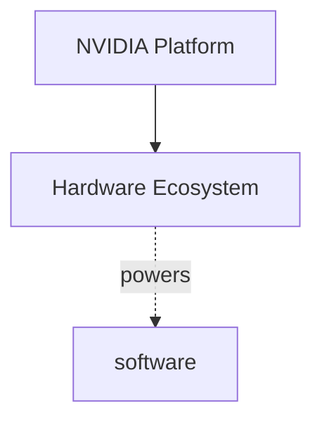

# NVIDIA Ecosystem Crawler

A comprehensive web crawler and analyzer for mapping NVIDIA's complete ecosystem including hardware, software, developer tools, business solutions, and technology platforms.

## Features

- **Deep Web Crawling**: Uses `crawl4ai` for efficient async crawling of NVIDIA's website (English and Chinese: `*.nvidia.com`, `*.nvidia.cn`, and paths `/en-us/`, `/zh-cn/`, `/zh-tw/`; other locale paths such as `/ja-jp/` are excluded)
- **Ecosystem Classification**: Automatically categorizes pages into 5 major ecosystems:
  - Hardware Ecosystem (GPUs, DGX, Jetson, DRIVE, Networking)
  - Software Ecosystem (CUDA, TensorRT, Omniverse, Clara, Isaac)
  - Developer Ecosystem (SDKs, NGC, Documentation, Tools)
  - Business Ecosystem (Enterprise, Partners, Industries, Cloud)
  - Technology Ecosystem (AI/ML, HPC, Data Center, Edge Computing)
- **Product & Technology Extraction**: Identifies NVIDIA products and technologies mentioned on pages
- **Multi-format Output**: Generates reports in Markdown, JSON, and Mermaid diagrams

## Installation

```bash
# Install dependencies
pip install -r requirements.txt

# Setup crawl4ai browser dependencies
crawl4ai-setup
```

## Usage

### 1. Full Ecosystem Pipeline (Crawl + Analyze + Report)

```bash
# Default settings (5 layers deep, up to 10000 pages)
python main.py

# Traverse ALL sub-pages (no include-pattern filtering)
python main.py --crawl-all

# Custom settings
python main.py --max-depth 3 --max-pages 500 --concurrent 10 --delay 1.0

# Custom output directory
python main.py --output-dir ./my_output
```

### Process Existing Data

If you have previously crawled data:

```bash
python main.py --load-data output/raw/crawl_data.json
```

### Command Line Options


| Option         | Default  | Description                                  |
| -------------- | -------- | -------------------------------------------- |
| `--max-depth`  | 5        | Maximum crawl depth                          |
| `--max-pages`  | 10000    | Maximum pages to crawl                       |
| `--concurrent` | 5        | Maximum concurrent requests                  |
| `--delay`      | 1.5      | Delay between requests (seconds)             |
| `--output-dir` | ./output | Output directory                             |
| `--load-data`  | -        | Load existing crawl data instead of crawling |
| `--seed-urls`  | -        | Custom seed URLs to start crawling           |
| `--crawl-all`  | False    | Traverse ALL sub-pages (skip include-pattern filter) |


### 2. PDF Document Crawler

Specialized crawler for extracting all PDF documents from NVIDIA website:

```bash
# Basic PDF crawl (catalog only)
python -m crawler.pdf_crawler --max-depth 4 --max-pages 2000

# Deep PDF crawl with more pages
python -m crawler.pdf_crawler --max-depth 5 --max-pages 5000 --concurrent 5

# Download PDFs to local folder
python -m crawler.pdf_crawler --max-pages 1000 --download
```

#### PDF Crawler Options


| Option         | Default  | Description                   |
| -------------- | -------- | ----------------------------- |
| `--max-depth`  | 4        | Maximum crawl depth           |
| `--max-pages`  | 2000     | Maximum pages to crawl        |
| `--concurrent` | 5        | Concurrent requests           |
| `--delay`      | 1.5      | Request delay (seconds)       |
| `--download`   | False    | Download PDFs to local folder |
| `--output-dir` | ./output/pdf | Output directory (under your project output root) |


#### PDF Crawler Output

Written under **`output/pdf/`** by default:

- `nvidia_pdf_catalog.json` — Complete PDF catalog with metadata
- `nvidia_pdf_urls.txt` — Plain text list of all PDF URLs
- `nvidia_pdf_report.md` — Markdown report organized by category
- `pdfs/` — Downloaded PDFs (if `--download` flag is used)

## Output layout

Artifacts are grouped under **`output/`** (see also `output/README.md`):

| Location | Role |
|----------|------|
| `output/raw/` | `crawl_data.json`, `classified_pages.json` |
| `output/indices/` | `nvidia_ecosystem.json`, `nvidia_products.json`, `nvidia_technologies.json` |
| `output/reports/` | Markdown / Mermaid reports |
| `output/pdf/` | PDF crawler outputs |
| `output/crawl.log` | Pipeline log |

### Report Generators

Four reporters transform classified crawl data into structured outputs:

| Generator | File | Output |
|-----------|------|--------|
| `MarkdownGenerator` | `generators/markdown_gen.py` | Bilingual Markdown reports (ecosystem, product catalog, technology stack) |
| `JSONGenerator` | `generators/json_gen.py` | Structured JSON (ecosystem, products, technologies) |
| `MermaidGenerator` | `generators/mermaid_gen.py` | Visual diagrams (mindmaps, flowcharts, pie charts, product/tech trees) |
| Software Ecosystem Report | `generators/software_ecosystem_report.py` | Software-focused synthesis report |

### Key report files (`reports/`)

| File | Generated by | Content |
|------|-------------|---------|
| `nvidia_ecosystem_report.md` | `MarkdownGenerator.generate_full_report()` | Bilingual 5-ecosystem overview with distribution table, categorized products/technologies, top keywords, sample URLs |
| `nvidia_ecosystem_diagrams.md` | `MermaidGenerator.generate_full_diagram_doc()` | Ecosystem mindmap, relationship flowchart, distribution pie chart, product hierarchy tree, technology stack tree |
| `nvidia_software_ecosystem_report.md` | `build_software_ecosystem_markdown()` | Software synthesis: subcategory distribution, technology stack with deduplication, associated technologies per ecosystem, limitations |
| `nvidia_ecosystem_summary_clean.md` | `scripts/summarize_ecosystem.py` | Compact deduplicated rollup from `indices/nvidia_ecosystem.json` |
| `nvidia_software_ecosystem_tree.md` | Mermaid mindmap | Software ecosystem tree visualization |
| `nvidia_hardware_ecosystem_tree.md` | Mermaid mindmap | Hardware ecosystem tree visualization |
| `nvidia_software_detailed_analysis.md` | Long-form analysis | Detailed software ecosystem analysis with tables |
| `nvidia_software_license_analysis.md` | Long-form analysis | License and open-source component analysis |

### Report Content Samples

**Ecosystem Report** (`nvidia_ecosystem_report.md`) — bilingual structure:
```markdown
# NVIDIA Ecosystem Landscape / NVIDIA 生态系统全景图
> Generated: 2026-04-27 14:00:00

## Overview / 概览
- **Total Pages Analyzed / 分析页面总数**: 5000
- **Crawl Duration / 爬取时长**: 3600.0s

| Ecosystem | 生态 | Pages | Percentage |
|-----------|------|-------|------------|
| Hardware Ecosystem | 硬件生态 | 1200 | 24.0% |
| Software Ecosystem | 软件生态 | 1500 | 30.0% |

## 1. Hardware Ecosystem / 硬件生态
### Products / 产品
#### Consumer GPU
- GeForce RTX 4090
- GeForce RTX 4080
```

**Mermaid Diagrams** (`nvidia_ecosystem_diagrams.md`) — embeddable in any Mermaid viewer:


**Ecosystem JSON** (`indices/nvidia_ecosystem.json`) — machine-readable structure:
```json
{
  "metadata": { "total_pages": 5000, "elapsed_seconds": 3600 },
  "ecosystems": {
    "hardware": {
      "name": "Hardware Ecosystem",
      "products": { "Consumer GPU": ["GeForce RTX 4090", "GeForce RTX 4080"] },
      "technologies": {},
      "keywords": {"GPU": 450, "CUDA": 300}
    }
  }
}
```

**Product Catalog JSON** (`indices/nvidia_products.json`):
```json
{
  "total_products": 180,
  "categories": {
    "Consumer GPU": {
      "count": 15,
      "products": [
        {"name": "GeForce RTX 4090", "urls": ["https://www.nvidia.com/en-us/geforce/graphics-cards/40-series/rtx-4090/"]}
      ]
    }
  }
}
```

Regenerate the filtered summary after a new `indices/nvidia_ecosystem.json` is produced:

```bash
python scripts/summarize_ecosystem.py
```

**Suggested sources of truth:** `raw/*.json` for evidence (often gitignored), `indices/*.json` for analytics, `reports/nvidia_software_ecosystem_report.md` for software narrative, `reports/nvidia_ecosystem_summary_clean.md` for a short rollup.


## Project Structure

```
nvidia-ecosystem/
├── scripts/
│   └── summarize_ecosystem.py # Rollup MD from nvidia_ecosystem.json
├── crawler/
│   ├── __init__.py
│   ├── nvidia_crawler.py      # Main crawler using crawl4ai
│   ├── url_manager.py         # URL queue and filtering
│   └── rate_limiter.py        # Request rate limiting
├── processors/
│   ├── __init__.py
│   ├── classifier.py          # Ecosystem classifier
│   └── data_extractor.py      # Product/technology extraction
├── generators/
│   ├── __init__.py
│   ├── markdown_gen.py        # Markdown report generator
│   ├── json_gen.py            # JSON data generator
│   ├── mermaid_gen.py         # Mermaid diagram generator
│   └── software_ecosystem_report.py  # NVIDIA software ecosystem report
├── output/                    # Output directory
├── config.py                  # Configuration settings
├── main.py                    # Main entry point
├── requirements.txt           # Python dependencies
└── README.md                  # This file
```

## Ecosystem Classification

The classifier uses URL patterns and content keywords to categorize pages:

### Hardware Ecosystem

- GPU product lines (GeForce, Quadro, Tesla, A100, H100, B100)
- DGX systems and HGX platforms
- Jetson embedded platforms
- DRIVE automotive platforms
- Networking (Mellanox, InfiniBand, BlueField)

### Software Ecosystem

- CUDA platform and libraries (cuDNN, cuBLAS, NCCL)
- TensorRT and Triton Inference Server
- Omniverse platform
- Clara (Healthcare), Isaac (Robotics)
- RAPIDS, NeMo, Merlin, Morpheus

### Developer Ecosystem

- SDKs and APIs
- NGC (NVIDIA GPU Cloud)
- Documentation and tutorials
- Developer tools (Nsight, profilers)
- Open source projects

### Business Ecosystem

- Enterprise solutions (AI Enterprise)
- Cloud partnerships (AWS, Azure, GCP)
- Industry solutions (Gaming, Automotive, Healthcare)
- Partner programs

### Technology Ecosystem

- AI/Deep Learning technologies
- High Performance Computing (HPC)
- Computer Vision and NLP
- Graphics technologies (Ray Tracing, DLSS)

## License

MIT License