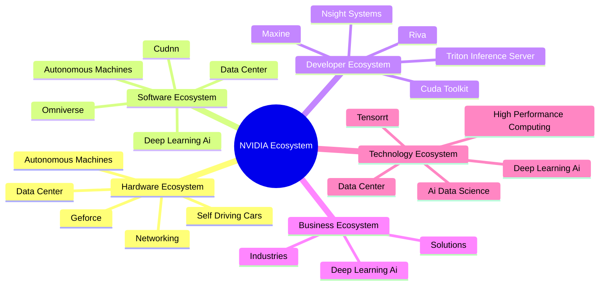
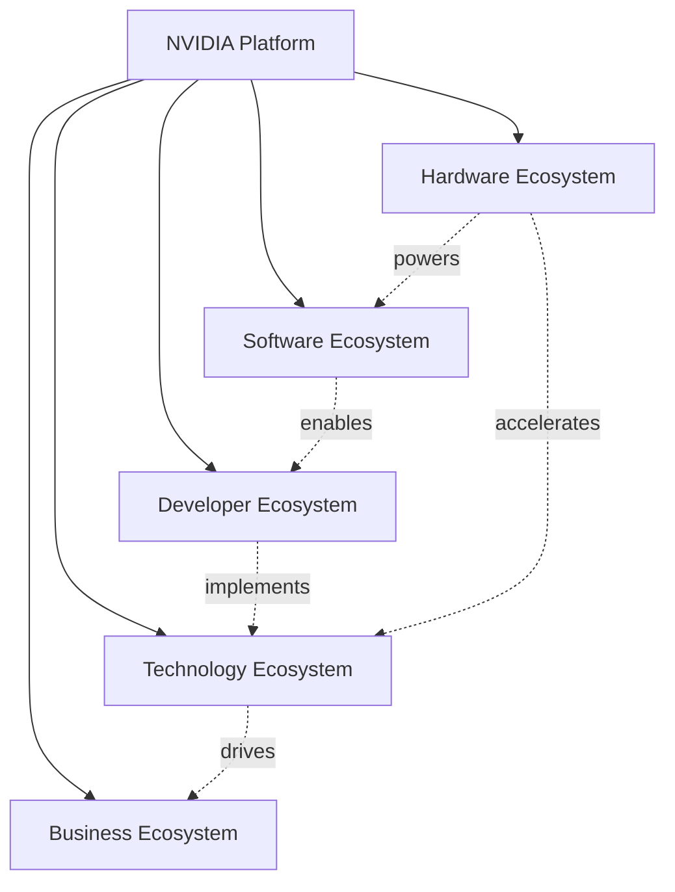
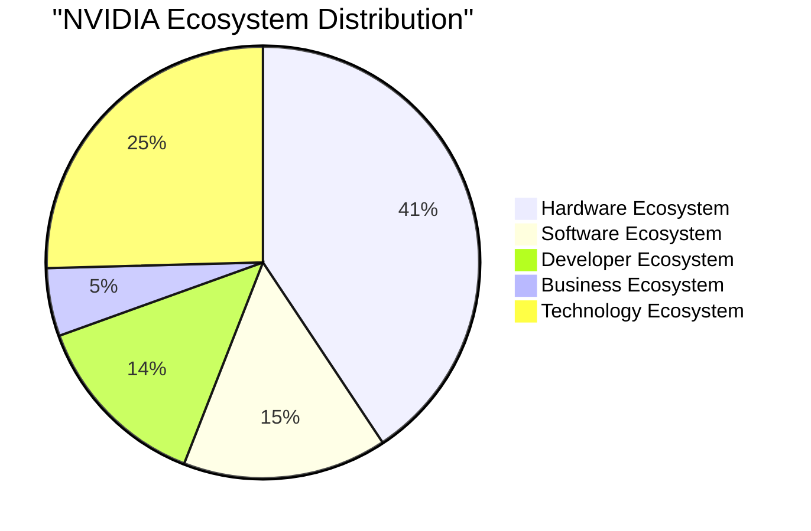
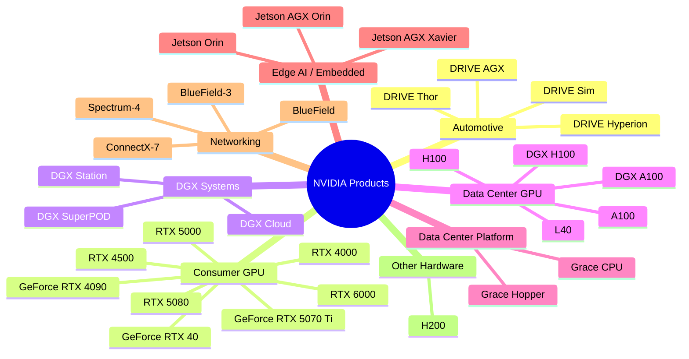
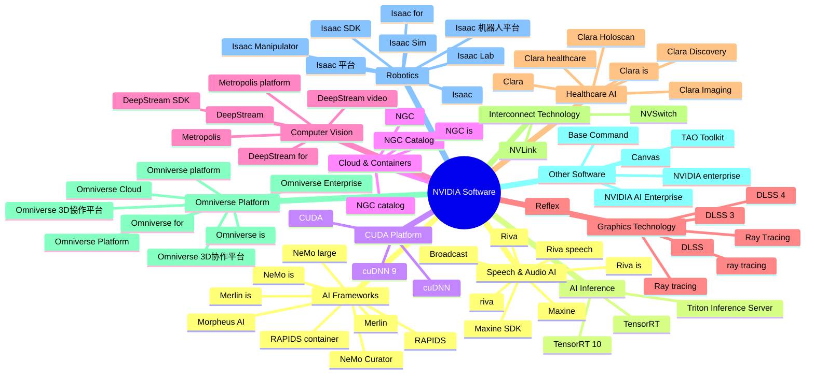

# NVIDIA Ecosystem Diagrams / NVIDIA 生态系统图表

> Generated: 2026-04-17 01:19:34

## Ecosystem Overview / 生态系统概览

## Ecosystem Relationships / 生态系统关系

## Distribution / 分布

## Product Hierarchy / 产品层级

## Technology Stack / 技术栈

