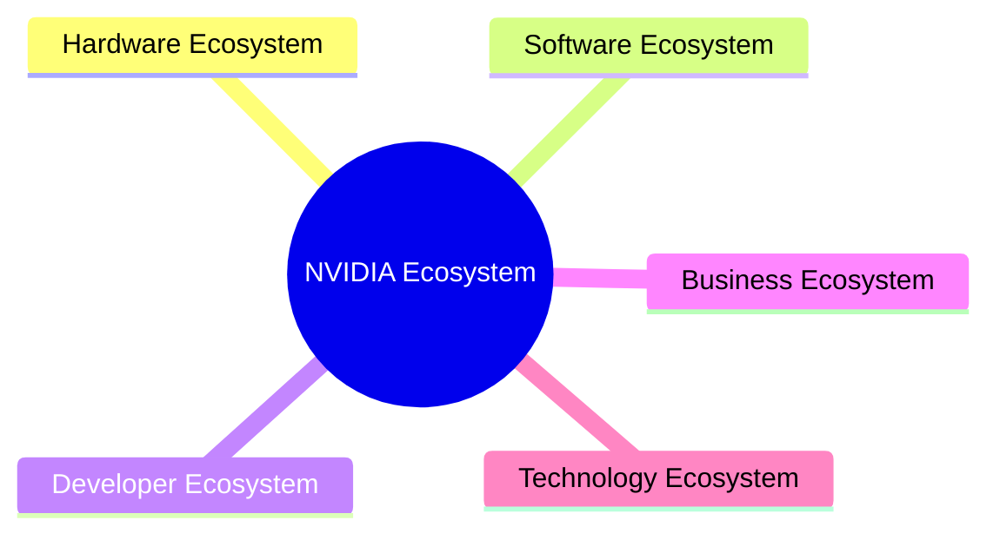
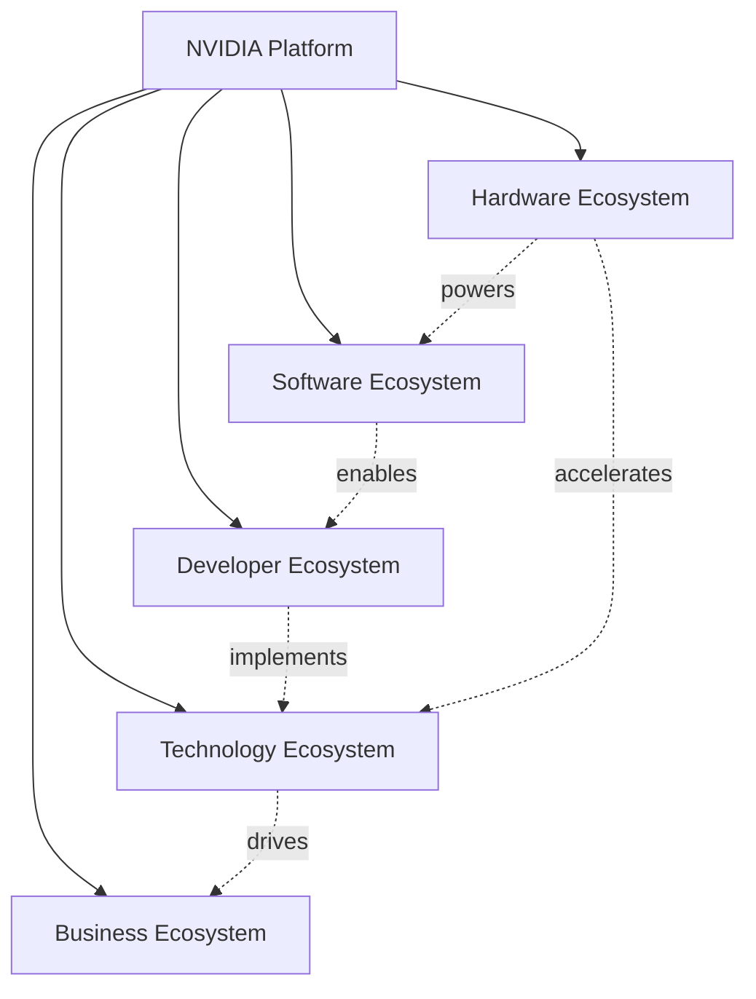
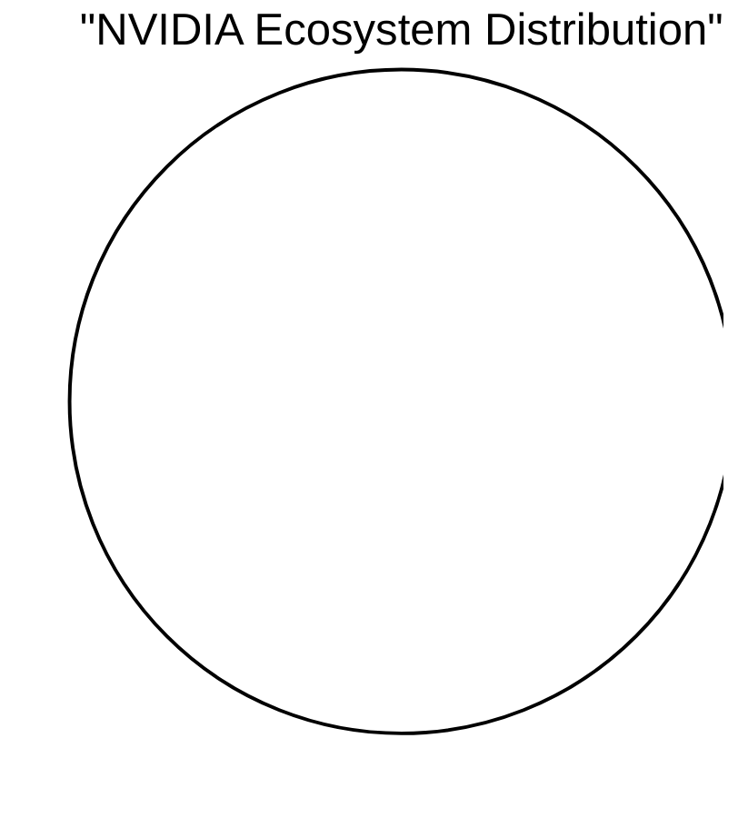

# NVIDIA Ecosystem Diagrams / NVIDIA 生态系统图表

> Generated: 2026-04-16 03:27:33

## Ecosystem Overview / 生态系统概览

```mermaid
mindmap
  root((NVIDIA Ecosystem))
    Hardware Ecosystem
    Software Ecosystem
    Developer Ecosystem
    Business Ecosystem
    Technology Ecosystem
```

## Ecosystem Relationships / 生态系统关系

```mermaid
flowchart TD
    NVIDIA["NVIDIA Platform"]
    hardware["Hardware Ecosystem"]
    NVIDIA --> hardware
    software["Software Ecosystem"]
    NVIDIA --> software
    developer["Developer Ecosystem"]
    NVIDIA --> developer
    business["Business Ecosystem"]
    NVIDIA --> business
    technology["Technology Ecosystem"]
    NVIDIA --> technology
    hardware -.->|"powers"| software
    software -.->|"enables"| developer
    developer -.->|"implements"| technology
    technology -.->|"drives"| business
    hardware -.->|"accelerates"| technology
```

## Distribution / 分布

```mermaid
pie title "NVIDIA Ecosystem Distribution"
```
