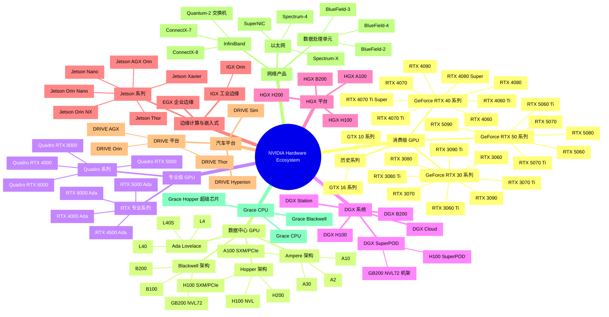
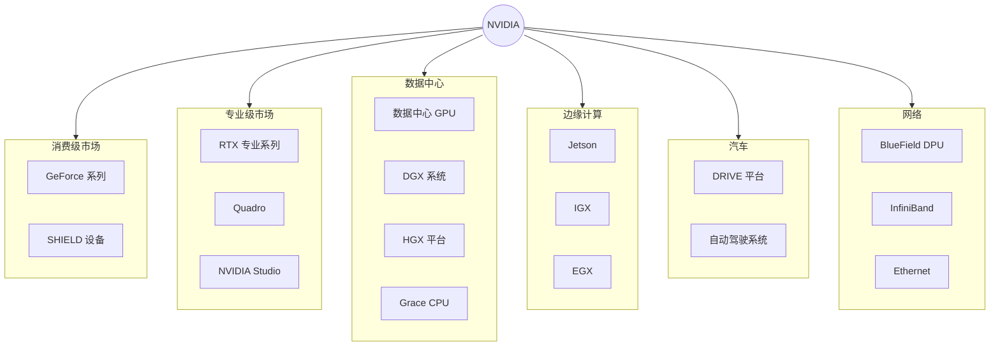
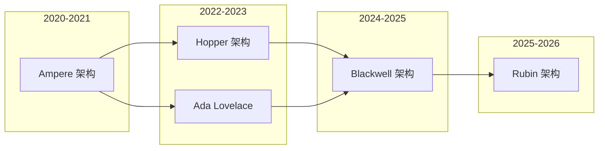
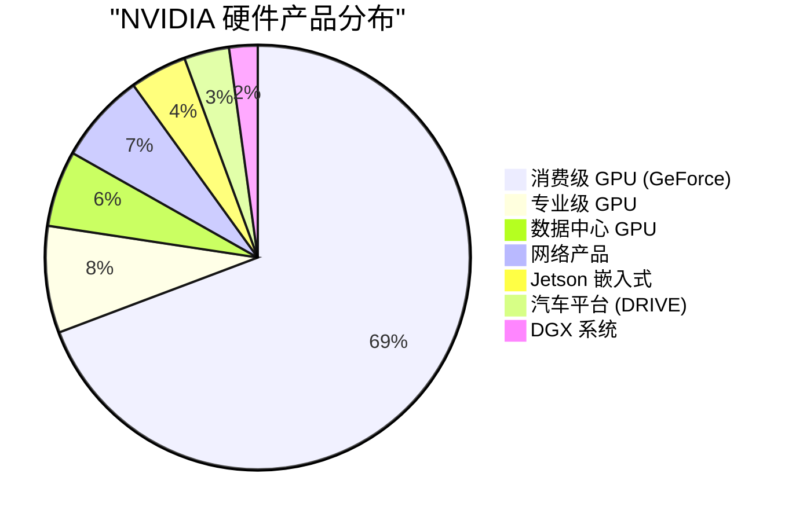
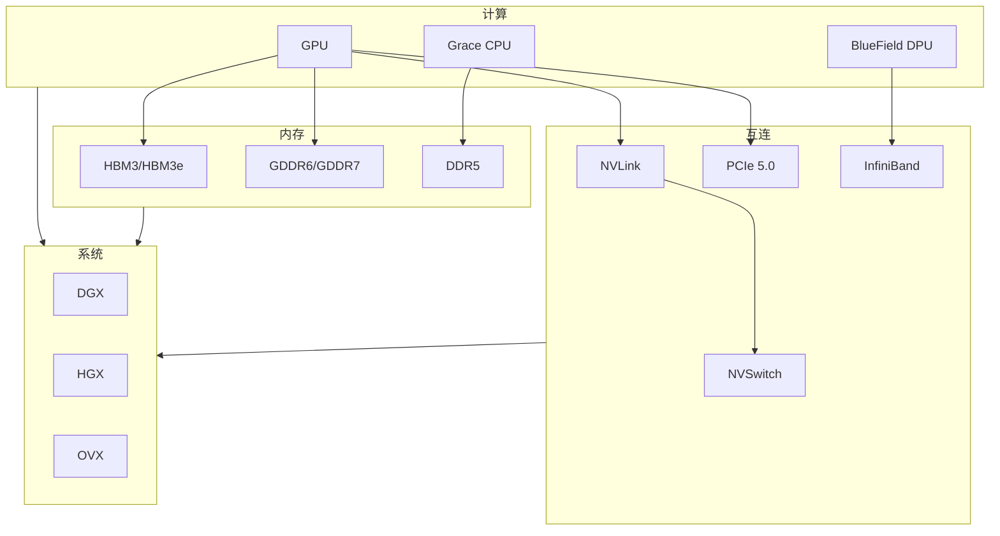

# NVIDIA 硬件生态系统树状图 / NVIDIA Hardware Ecosystem Tree

> 基于 10,000 页面爬取分析结果生成
> Generated: 2026-01-27

## 完整硬件生态思维导图

## 硬件产品线层次结构

## GPU 架构演进

## 硬件生态分类统计

## 详细产品分类表格

### 1. 数据中心 GPU

| 架构 | 型号 | 显存 | 主要用途 |
|------|------|------|----------|
| **Blackwell** | B200 | 192GB HBM3e | AI 训练/推理 |
| | B100 | 192GB HBM3e | AI 训练/推理 |
| | GB200 NVL72 | 13.5TB | 超大规模 AI |
| **Hopper** | H200 | 141GB HBM3e | AI 训练/推理 |
| | H100 SXM | 80GB HBM3 | AI 训练 |
| | H100 PCIe | 80GB HBM3 | AI 推理 |
| **Ada** | L40S | 48GB GDDR6 | AI 推理/图形 |
| | L40 | 48GB GDDR6 | AI 推理 |
| | L4 | 24GB GDDR6 | 视频/AI 推理 |
| **Ampere** | A100 | 80/40GB HBM2e | AI 训练/HPC |
| | A30 | 24GB HBM2 | 推理 |
| | A10 | 24GB GDDR6 | 推理/图形 |

### 2. 消费级 GPU (GeForce)

| 系列 | 型号 | 架构 | 显存 |
|------|------|------|------|
| **RTX 50** | 5090 | Blackwell | 32GB GDDR7 |
| | 5080 | Blackwell | 16GB GDDR7 |
| | 5070 Ti | Blackwell | 16GB GDDR7 |
| | 5070 | Blackwell | 12GB GDDR7 |
| **RTX 40** | 4090 | Ada | 24GB GDDR6X |
| | 4080 Super | Ada | 16GB GDDR6X |
| | 4070 Ti Super | Ada | 16GB GDDR6X |
| | 4060 Ti | Ada | 16/8GB GDDR6 |
| **RTX 30** | 3090 Ti | Ampere | 24GB GDDR6X |
| | 3080 Ti | Ampere | 12GB GDDR6X |
| | 3070 | Ampere | 8GB GDDR6 |

### 3. DGX 系统

| 系统 | GPU 配置 | 总显存 | 用途 |
|------|----------|--------|------|
| **DGX B200** | 8x B200 | 1.5TB | AI 超算 |
| **DGX H100** | 8x H100 | 640GB | AI 训练 |
| **DGX Station** | 4x GPU | 可变 | 工作站 |
| **DGX SuperPOD** | 多机架 | PB 级 | 超大规模 |
| **DGX Cloud** | 云服务 | 按需 | AI 即服务 |

### 4. Jetson 嵌入式

| 型号 | SoC | 算力 | 应用场景 |
|------|-----|------|----------|
| **AGX Thor** | Thor | 2000 TOPS | 自动驾驶/机器人 |
| **AGX Orin** | Orin | 275 TOPS | 高端边缘 AI |
| **Orin NX** | Orin | 100 TOPS | 中端边缘 AI |
| **Orin Nano** | Orin | 40 TOPS | 入门边缘 AI |
| **Xavier NX** | Xavier | 21 TOPS | 紧凑边缘 |
| **Nano** | Tegra | 0.5 TOPS | 教育/DIY |

### 5. DRIVE 汽车平台

| 平台 | 芯片 | 算力 | 级别 |
|------|------|------|------|
| **DRIVE Thor** | Thor | 2000 TOPS | L4 自动驾驶 |
| **DRIVE Orin** | Orin | 254 TOPS | L2+/L3 |
| **DRIVE AGX** | Orin/Xavier | 可变 | 开发平台 |
| **DRIVE Hyperion** | 传感器套件 | - | 参考设计 |

### 6. 网络产品

| 类别 | 产品 | 特点 |
|------|------|------|
| **DPU** | BlueField-4 | 800Gb/s, AI 加速 |
| | BlueField-3 | 400Gb/s |
| **InfiniBand** | ConnectX-8 | 800Gb/s |
| | Quantum-2 | 64 端口交换机 |
| **Ethernet** | Spectrum-X | AI 优化以太网 |
| | SuperNIC | 低延迟网卡 |

### 7. Grace CPU

| 产品 | 配置 | 用途 |
|------|------|------|
| **Grace Hopper** | Grace + H100 | AI 超级芯片 |
| **Grace Blackwell** | Grace + B200 | 下一代超级芯片 |
| **Grace CPU** | 72 核 Arm | HPC/云计算 |

## 硬件系统架构图

## 产品发现统计

| 硬件类别 | 发现数量 |
|----------|----------|
| 消费级 GPU | 383 款 |
| 专业级 GPU | 45 款 |
| 数据中心 GPU | 32 款 |
| 汽车平台 | 19 款 |
| Jetson 嵌入式 | 24 款 |
| 网络产品 | 38 款 |
| DGX 系统 | 12 款 |
| **总计** | **562 款** |

---

*此树状图基于 NVIDIA 官网 10,000 页面爬取分析生成*
