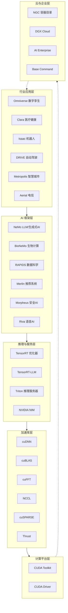
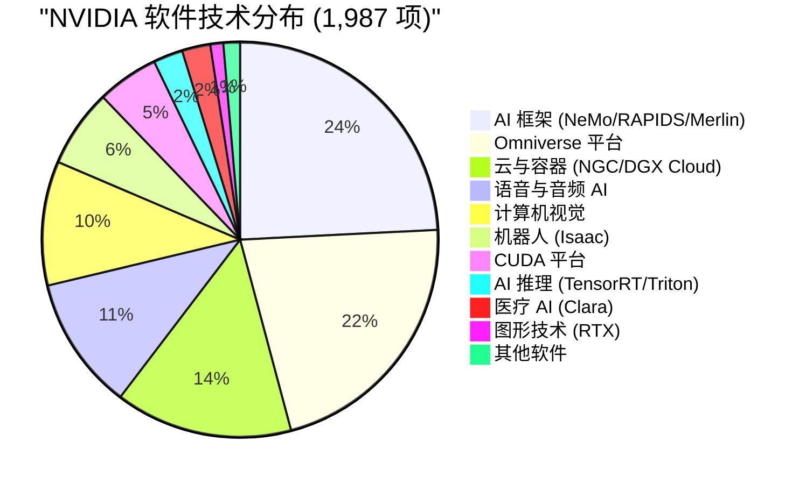
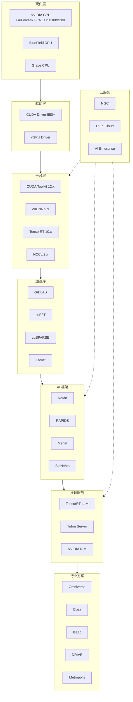

# NVIDIA 软件生态系统树状图 / NVIDIA Software Ecosystem Tree

> 基于 10,000 页面爬取分析结果生成
> Generated: 2026-01-27

## 完整软件生态思维导图

```mermaid
mindmap
  root((NVIDIA Software Ecosystem))
    CUDA_Platform[CUDA 计算平台]
      CUDA_Toolkit[CUDA Toolkit 12.x]
        nvcc[NVCC 编译器]
        cuda_gdb[CUDA-GDB]
        cuda_memcheck[Compute Sanitizer]
        nvprof[nvprof]
      Math_Libraries[数学库]
        cuBLAS[cuBLAS]
        cuBLASLt[cuBLAS Light]
        cuSOLVER[cuSOLVER]
        cuSPARSE[cuSPARSE]
        cuSPARSELt[cuSPARSE Light]
        cuFFT[cuFFT]
        cuFFTMp[cuFFT Multi-Process]
        cuRAND[cuRAND]
      Parallel_Primitives[并行原语]
        Thrust[Thrust]
        CUB[CUB]
        libcu[libcu++]
      Communication[通信库]
        NCCL[NCCL]
        NVRTC[NVRTC]
        CUDA_Streams[CUDA Streams]
      cuDNN[cuDNN 9.x]
        Tensor_Core_Ops[Tensor Core Ops]
        Graph_API[Graph API]
        Fusion[Kernel Fusion]
    
    AI_Inference[AI 推理引擎]
      TensorRT[TensorRT 10.x]
        TRT_Core[TensorRT Core]
        TRT_LLM[TensorRT-LLM]
        TRT_OSS[TensorRT OSS]
        Polygraphy[Polygraphy]
        ONNX_Parser[ONNX Parser]
      Triton[Triton Inference Server]
        Model_Repository[Model Repository]
        Dynamic_Batching[Dynamic Batching]
        Ensemble_Models[Ensemble Models]
        Backend_API[Backend API]
        Model_Analyzer[Model Analyzer]
        Perf_Analyzer[Perf Analyzer]
      NIM[NVIDIA NIM]
        NIM_LLM[NIM for LLMs]
        NIM_Embedding[NIM Embedding]
        NIM_Vision[NIM Vision]
    
    AI_Frameworks[AI 开发框架]
      NeMo[NeMo Framework]
        NeMo_Curator[NeMo Curator]
        NeMo_Guardrails[NeMo Guardrails]
        NeMo_Customizer[NeMo Customizer]
        NeMo_Evaluator[NeMo Evaluator]
        NeMo_Retriever[NeMo Retriever]
        NeMo_ASR[NeMo ASR]
        NeMo_TTS[NeMo TTS]
        NeMo_NLP[NeMo NLP]
      RAPIDS[RAPIDS Suite]
        cuDF[cuDF 数据帧]
        cuML[cuML 机器学习]
        cuGraph[cuGraph 图分析]
        cuVS[cuVS 向量搜索]
        cuSpatial[cuSpatial 空间分析]
        cuSignal[cuSignal 信号处理]
        Dask_cuDF[Dask-cuDF]
        BlazingSQL[BlazingSQL]
      Merlin[Merlin 推荐系统]
        NVTabular[NVTabular]
        HugeCTR[HugeCTR]
        Transformers4Rec[Transformers4Rec]
        Merlin_Models[Merlin Models]
        Merlin_Systems[Merlin Systems]
        Merlin_SOK[Sparse Operation Kit]
      Morpheus[Morpheus 安全AI]
        Morpheus_SDK[Morpheus SDK]
        Morpheus_Pipeline[Pipeline]
        Digital_Fingerprinting[Digital Fingerprinting]
      BioNeMo[BioNeMo 生物计算]
        ESMFold[ESMFold]
        AlphaFold2[AlphaFold2]
        OpenFold[OpenFold]
        MegaMolBART[MegaMolBART]
        DiffDock[DiffDock]
      PhysicsNeMo[Physics NeMo]
        Modulus[Modulus]
        FourCastNet[FourCastNet]
        GraphCast[GraphCast]
    
    Omniverse[Omniverse 平台]
      Omniverse_Core[核心组件]
        USD[Universal Scene Description]
        Nucleus[Nucleus Server]
        RTX_Renderer[RTX Renderer]
        PhysX[PhysX 5.x]
        OmniGraph[OmniGraph]
      Omniverse_Apps[应用程序]
        USD_Composer[USD Composer]
        USD_Presenter[USD Presenter]
        Audio2Face[Audio2Face]
        Machinima[Machinima]
        View[Omniverse View]
      Kit[Omniverse Kit]
        Kit_SDK[Kit SDK]
        Extensions[Extensions]
        Kit_App_Template[Kit App Template]
      Connectors[连接器]
        Maya_Connector[Maya]
        3dsMax_Connector[3ds Max]
        Revit_Connector[Revit]
        SketchUp_Connector[SketchUp]
        Unreal_Connector[Unreal Engine]
        Blender_Connector[Blender]
      Replicator[Omniverse Replicator]
        Synthetic_Data[Synthetic Data Gen]
        Domain_Randomization[Domain Randomization]
    
    Industry_Solutions[行业解决方案]
      Clara[Clara 医疗AI]
        Clara_Imaging[Clara Imaging]
        Clara_Genomics[Clara Genomics]
        Clara_Guardian[Clara Guardian]
        Clara_Parabricks[Clara Parabricks]
        MONAI[MONAI]
        MONAI_Label[MONAI Label]
        MONAI_Deploy[MONAI Deploy]
        FLARE[FLARE 联邦学习]
      Isaac[Isaac 机器人]
        Isaac_Sim[Isaac Sim]
        Isaac_ROS[Isaac ROS]
        Isaac_GR00T[Isaac GR00T]
        Isaac_Lab[Isaac Lab]
        Isaac_Perceptor[Isaac Perceptor]
        Isaac_Manipulator[Isaac Manipulator]
        cuMotion[cuMotion]
        Nova[Nova 参考平台]
      DRIVE[DRIVE 自动驾驶]
        DRIVE_Sim[DRIVE Sim]
        DRIVE_AV[DRIVE AV]
        DRIVE_IX[DRIVE IX]
        DriveWorks[DriveWorks SDK]
        DRIVE_OS[DRIVE OS]
        DRIVE_Mapping[DRIVE Mapping]
      Metropolis[Metropolis 智慧城市]
        DeepStream[DeepStream SDK 7.x]
        TAO_Toolkit[TAO Toolkit 5.x]
        Vision_AI[Vision AI]
        Metropolis_Microservices[Microservices]
        VIA[Video Insights Agent]
      Aerial[Aerial 5G/6G]
        cuBB[cuBB]
        cuPHY[cuPHY]
        Aerial_SDK[Aerial SDK]
        Sionna[Sionna]
    
    Speech_Audio[语音与音频AI]
      Riva[Riva SDK]
        Riva_ASR[ASR 语音识别]
        Riva_TTS[TTS 语音合成]
        Riva_NMT[NMT 神经翻译]
        Riva_NLP[NLP 自然语言]
        Parakeet[Parakeet ASR]
        FastPitch[FastPitch TTS]
        HiFi_GAN[HiFi-GAN]
      Maxine[Maxine SDK]
        Video_Effects[Video Effects]
        Audio_Effects[Audio Effects]
        AR_SDK[AR SDK]
        Eye_Contact[Eye Contact]
        Background_Effects[Background Effects]
        Face_Expression[Face Expression]
      Broadcast[Broadcast App]
        Noise_Removal[Noise Removal]
        Virtual_Background[Virtual Background]
        Auto_Frame[Auto Frame]
    
    Graphics_Tech[图形技术]
      RTX_Technology[RTX 技术]
        Ray_Tracing[Real-Time Ray Tracing]
        DLSS[DLSS 3.5]
        DLSS_FG[DLSS Frame Generation]
        DLSS_RR[DLSS Ray Reconstruction]
        Reflex[NVIDIA Reflex]
        Streamline[Streamline SDK]
      OptiX[OptiX 8.x]
        OptiX_Core[OptiX Core]
        AI_Denoiser[AI Denoiser]
        MDL_SDK[MDL SDK]
      VRWorks[VRWorks]
        VRS[Variable Rate Shading]
        SLI[SLI 多GPU]
        LMS[Lens Matched Shading]
      PhysX_SDK[PhysX SDK 5.x]
        Rigid_Body[Rigid Body]
        Cloth[Cloth Simulation]
        Fluid[Fluid Simulation]
        Destruction[Destruction]
    
    Cloud_Platform[云平台与容器]
      NGC[NGC Catalog]
        AI_Containers[AI 容器]
        HPC_Containers[HPC 容器]
        Partner_Containers[合作伙伴容器]
        Private_Registry[Private Registry]
        NGC_CLI[NGC CLI]
      DGX_Cloud[DGX Cloud]
        DGX_Cloud_Compute[Compute 实例]
        DGX_Cloud_Storage[Storage]
        DGX_Cloud_Networking[Networking]
      Base_Command[Base Command]
        BCM[Base Command Manager]
        BCP[Base Command Platform]
        Job_Scheduler[Job Scheduler]
        Multi_Node_Training[Multi-Node Training]
      AI_Enterprise[AI Enterprise 5.x]
        vGPU[vGPU]
        VMware_Integration[VMware 集成]
        K8s_Operator[GPU Operator]
        MIG[Multi-Instance GPU]
        Time_Slicing[Time Slicing]
      AI_Workbench[AI Workbench]
        Local_Dev[Local Development]
        Cloud_Deploy[Cloud Deployment]
        Git_Integration[Git Integration]
    
    Developer_Tools[开发者工具]
      Nsight_Tools[Nsight 工具集]
        Nsight_Systems[Nsight Systems]
        Nsight_Compute[Nsight Compute]
        Nsight_Graphics[Nsight Graphics]
        Nsight_Aftermath[Nsight Aftermath]
        Nsight_NVTX[NVTX]
      Profilers[性能分析]
        CUPTI[CUPTI]
        Nsight_DL_Profiler[DL Profiler]
        DCGM[DCGM]
      Debuggers[调试工具]
        CUDA_GDB[CUDA-GDB]
        Compute_Sanitizer[Compute Sanitizer]
        CUDA_Memcheck[CUDA Memcheck]
      Build_Tools[构建工具]
        NVCC[NVCC]
        NVML[NVML]
        CUDA_Driver_API[Driver API]
        CUDA_Runtime_API[Runtime API]
```

## 软件生态层次结构

## 软件技术分类统计

## 详细软件分类表格

### 1. CUDA 计算平台 (100 项)

| 类别 | 软件 | 版本 | 功能描述 |
|------|------|------|----------|
| **核心工具** | CUDA Toolkit | 12.x | GPU 编程完整工具包 |
| | NVCC | 12.x | CUDA C++ 编译器 |
| | NVRTC | 12.x | 运行时编译库 |
| | CUDA Driver | 550+ | GPU 驱动程序 |
| **数学库** | cuBLAS | 12.x | 线性代数 (BLAS) |
| | cuBLASLt | 12.x | 轻量级 BLAS |
| | cuSOLVER | 12.x | 稠密/稀疏求解器 |
| | cuSPARSE | 12.x | 稀疏矩阵运算 |
| | cuSPARSELt | 0.6 | 结构化稀疏 |
| | cuFFT | 12.x | 快速傅里叶变换 |
| | cuFFTMp | 12.x | 多进程 FFT |
| | cuRAND | 12.x | 随机数生成 |
| **并行原语** | Thrust | 2.x | C++ 并行算法库 |
| | CUB | 2.x | GPU 原语库 |
| | libcu++ | 2.x | CUDA C++ 标准库 |
| **通信** | NCCL | 2.x | 多 GPU 集合通信 |
| **深度学习** | cuDNN | 9.x | 深度神经网络原语 |

### 2. AI 推理引擎 (48 项)

| 软件 | 版本 | 功能描述 |
|------|------|----------|
| **TensorRT** | 10.x | 高性能推理优化器 |
| TensorRT-LLM | 0.x | 大语言模型推理 |
| TensorRT OSS | - | 开源插件 |
| Polygraphy | - | 模型调试工具 |
| ONNX Parser | - | ONNX 模型解析 |
| **Triton Server** | 2.x | 推理服务框架 |
| Model Repository | - | 模型存储管理 |
| Model Analyzer | - | 模型性能分析 |
| Perf Analyzer | - | 推理性能测试 |
| **NVIDIA NIM** | - | 微服务推理 |
| NIM for LLMs | - | 大语言模型服务 |
| NIM Embedding | - | 嵌入向量服务 |

### 3. AI 开发框架 (481 项)

| 框架 | 组件 | 功能描述 |
|------|------|----------|
| **NeMo** | NeMo Framework | 生成式 AI 开发框架 |
| | NeMo Curator | 数据集处理与过滤 |
| | NeMo Guardrails | LLM 安全防护 |
| | NeMo Customizer | 模型微调工具 |
| | NeMo Evaluator | 模型评估工具 |
| | NeMo Retriever | RAG 检索增强 |
| **RAPIDS** | cuDF | GPU 加速数据帧 |
| | cuML | GPU 加速机器学习 |
| | cuGraph | GPU 加速图分析 |
| | cuVS | GPU 向量搜索 |
| | cuSpatial | 空间分析 |
| | Dask-cuDF | 分布式数据帧 |
| **Merlin** | NVTabular | 特征工程 |
| | HugeCTR | 推荐模型训练 |
| | Transformers4Rec | Transformer 推荐 |
| | Merlin Models | 预置推荐模型 |
| **Morpheus** | Morpheus SDK | 网络安全 AI |
| | Digital Fingerprinting | 数字指纹检测 |
| **BioNeMo** | BioNeMo Framework | 生物计算框架 |
| | ESMFold | 蛋白质折叠 |
| | AlphaFold2 | 蛋白质结构预测 |
| | MegaMolBART | 分子生成 |
| | DiffDock | 分子对接 |
| **PhysicsNeMo** | Modulus | 物理信息神经网络 |
| | FourCastNet | 天气预报 AI |

### 4. Omniverse 平台 (430 项)

| 类别 | 软件 | 功能描述 |
|------|------|----------|
| **核心** | USD | 通用场景描述格式 |
| | Nucleus | 协作服务器 |
| | RTX Renderer | 实时光追渲染 |
| | PhysX 5.x | 物理仿真引擎 |
| | OmniGraph | 节点式编程 |
| **应用** | USD Composer | 3D 场景创作 |
| | USD Presenter | 交互式展示 |
| | Audio2Face | 音频驱动面部动画 |
| | Machinima | 电影动画制作 |
| **开发** | Kit SDK | 应用开发框架 |
| | Extensions | 扩展系统 |
| **连接器** | Maya Connector | Autodesk Maya |
| | 3ds Max Connector | Autodesk 3ds Max |
| | Revit Connector | Autodesk Revit |
| | Blender Connector | Blender |
| | Unreal Connector | Unreal Engine |
| **工具** | Replicator | 合成数据生成 |

### 5. 行业解决方案

#### Clara 医疗 AI (46 项)

| 软件 | 功能描述 |
|------|----------|
| Clara Imaging | 医学影像 AI |
| Clara Genomics | 基因组分析 |
| Clara Guardian | 患者监护 |
| Clara Parabricks | GPU 基因组测序 |
| MONAI | 医学影像框架 |
| MONAI Label | 标注工具 |
| MONAI Deploy | 部署框架 |
| FLARE | 联邦学习框架 |

#### Isaac 机器人 (127 项)

| 软件 | 功能描述 |
|------|----------|
| Isaac Sim | 机器人仿真平台 |
| Isaac ROS | ROS 加速包 |
| Isaac GR00T | 人形机器人平台 |
| Isaac Lab | 强化学习环境 |
| Isaac Perceptor | 感知系统 |
| Isaac Manipulator | 机械臂控制 |
| cuMotion | 运动规划加速 |
| Nova | AMR 参考平台 |

#### DRIVE 自动驾驶

| 软件 | 功能描述 |
|------|----------|
| DRIVE Sim | 自动驾驶仿真 |
| DRIVE AV | 自动驾驶软件栈 |
| DRIVE IX | 智能座舱 |
| DriveWorks SDK | 传感器处理 |
| DRIVE OS | 车载操作系统 |
| DRIVE Mapping | 高精地图 |

#### Metropolis 智慧城市

| 软件 | 版本 | 功能描述 |
|------|------|----------|
| DeepStream SDK | 7.x | 视频分析管线 |
| TAO Toolkit | 5.x | 迁移学习工具 |
| Vision AI | - | 视觉 AI 应用 |
| Microservices | - | 视频分析微服务 |

### 6. 语音与音频 AI (217 项)

| 软件 | 组件 | 功能描述 |
|------|------|----------|
| **Riva SDK** | Riva ASR | 语音识别 |
| | Riva TTS | 语音合成 |
| | Riva NMT | 神经机器翻译 |
| | Parakeet | 高精度 ASR |
| | FastPitch | 快速 TTS |
| | HiFi-GAN | 声码器 |
| **Maxine SDK** | Video Effects | 视频增强 |
| | Audio Effects | 音频增强 |
| | AR SDK | 增强现实 |
| | Eye Contact | 眼神校正 |
| | Background Effects | 背景处理 |
| **Broadcast** | Noise Removal | 噪声消除 |
| | Virtual Background | 虚拟背景 |
| | Auto Frame | 自动取景 |

### 7. 图形技术 (21 项)

| 软件 | 功能描述 |
|------|----------|
| **RTX** | 实时光线追踪 |
| DLSS 3.5 | AI 超分辨率 |
| DLSS Frame Generation | AI 帧生成 |
| DLSS Ray Reconstruction | 光追重建 |
| Reflex | 低延迟技术 |
| Streamline SDK | 渲染集成 |
| **OptiX 8.x** | 光追开发 SDK |
| AI Denoiser | AI 降噪 |
| MDL SDK | 材质定义语言 |
| **PhysX 5.x** | 物理仿真 |
| **VRWorks** | VR 开发工具 |

### 8. 云平台与企业 (288 项)

| 平台 | 组件 | 功能描述 |
|------|------|----------|
| **NGC** | AI Containers | AI 容器镜像 |
| | HPC Containers | HPC 容器 |
| | NGC CLI | 命令行工具 |
| | Private Registry | 私有仓库 |
| **DGX Cloud** | Compute | GPU 计算实例 |
| | Storage | 高性能存储 |
| **Base Command** | BCM | 集群管理 |
| | BCP | 训练平台 |
| **AI Enterprise** | vGPU | GPU 虚拟化 |
| | GPU Operator | K8s 集成 |
| | MIG | 多实例 GPU |
| **AI Workbench** | - | 开发环境 |

### 9. 开发者工具

| 类别 | 工具 | 功能描述 |
|------|------|----------|
| **Nsight** | Nsight Systems | 系统级分析 |
| | Nsight Compute | 内核级分析 |
| | Nsight Graphics | 图形调试 |
| | Nsight Aftermath | 崩溃分析 |
| | NVTX | 性能标记 |
| **分析** | CUPTI | 性能 API |
| | DCGM | GPU 管理 |
| **调试** | CUDA-GDB | GPU 调试器 |
| | Compute Sanitizer | 内存检查 |
| **构建** | NVCC | CUDA 编译器 |
| | NVML | 管理库 |

## 技术栈完整关系图

## 软件产品统计汇总

| 类别 | 软件数量 | 主要产品 |
|------|----------|----------|
| AI 框架 | 481 | NeMo, RAPIDS, Merlin, BioNeMo, Morpheus |
| Omniverse | 430 | USD, Kit, Connectors, Replicator |
| 云与容器 | 288 | NGC, DGX Cloud, AI Enterprise |
| 语音音频 | 217 | Riva, Maxine, Broadcast |
| 计算机视觉 | 202 | DeepStream, TAO, Vision AI |
| 机器人 | 127 | Isaac Sim, Isaac ROS, GR00T |
| CUDA 平台 | 100 | CUDA Toolkit, cuDNN, cuBLAS, NCCL |
| AI 推理 | 48 | TensorRT, TensorRT-LLM, Triton, NIM |
| 医疗 AI | 46 | Clara, MONAI, Parabricks |
| 图形技术 | 21 | RTX, DLSS, OptiX, PhysX |
| 互连技术 | 9 | NVLink, NVSwitch |
| 其他 | 18 | 杂项工具 |
| **总计** | **1,987** | - |

---

*此树状图基于 NVIDIA 官网 10,000 页面爬取分析生成，细化到每个具体软件产品*
