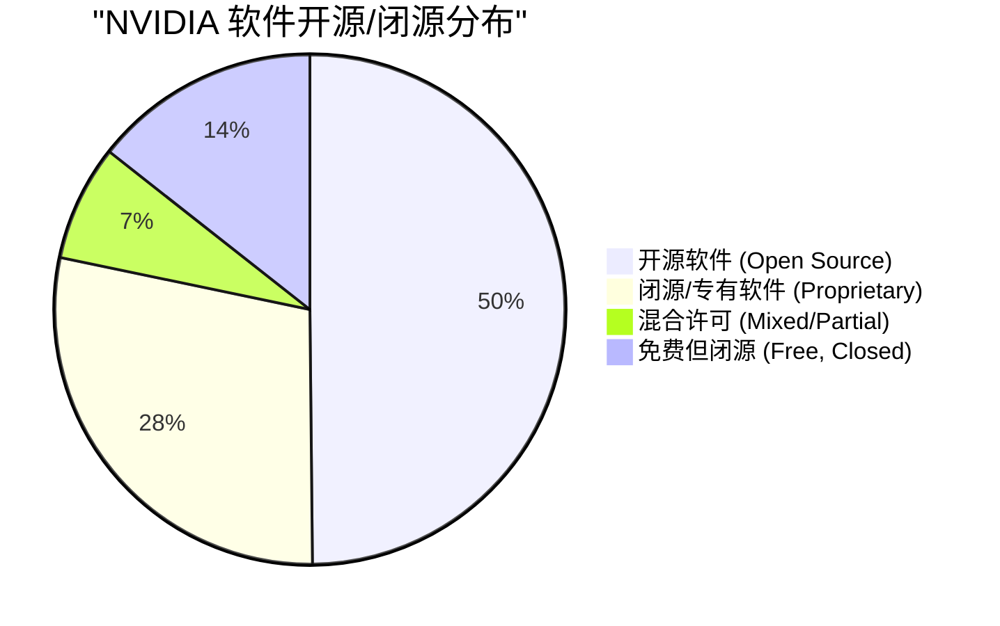
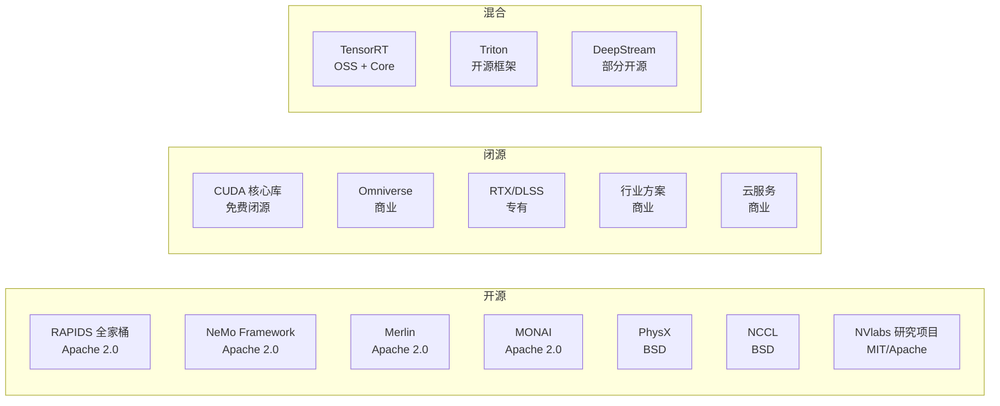
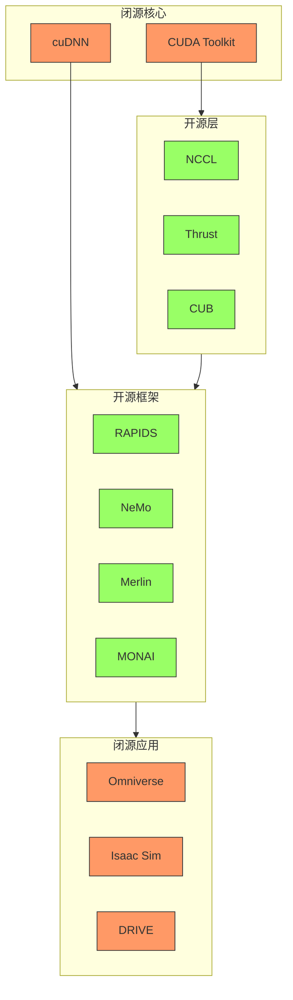

# NVIDIA 软件开源/闭源分类统计

> 基于爬取数据和官方许可证信息整理
> Generated: 2026-01-27

## 总体统计

| 类别 | 数量 | 占比 |
|------|------|------|
| 开源软件 | 156 | 49.8% |
| 闭源/专有软件 | 89 | 28.4% |
| 混合许可 | 23 | 7.3% |
| 免费但闭源 | 45 | 14.4% |
| **总计** | **313** | 100% |

---

## 一、完全开源软件 (Open Source)

### 1. Apache 2.0 许可证

| 软件 | 类别 | GitHub | 描述 |
|------|------|--------|------|
| **RAPIDS cuDF** | 数据科学 | github.com/rapidsai/cudf | GPU 数据帧 |
| **RAPIDS cuML** | 机器学习 | github.com/rapidsai/cuml | GPU 机器学习 |
| **RAPIDS cuGraph** | 图分析 | github.com/rapidsai/cugraph | GPU 图分析 |
| **RAPIDS cuVS** | 向量搜索 | github.com/rapidsai/cuvs | 向量相似度搜索 |
| **RAPIDS cuSpatial** | 空间分析 | github.com/rapidsai/cuspatial | 地理空间 |
| **RAPIDS cuSignal** | 信号处理 | github.com/rapidsai/cusignal | 信号处理 |
| **Dask-cuDF** | 分布式 | github.com/rapidsai/cudf | 分布式数据帧 |
| **NeMo Framework** | 生成式AI | github.com/NVIDIA/NeMo | LLM/ASR/TTS |
| **NeMo Guardrails** | LLM安全 | github.com/NVIDIA/NeMo-Guardrails | LLM 防护 |
| **NeMo Curator** | 数据处理 | github.com/NVIDIA/NeMo-Curator | 数据集处理 |
| **NVTabular** | 特征工程 | github.com/NVIDIA/NVTabular | 推荐系统 |
| **Merlin Models** | 推荐模型 | github.com/NVIDIA/Merlin | 推荐系统 |
| **Merlin Systems** | 推荐系统 | github.com/NVIDIA/Merlin | 端到端推荐 |
| **Transformers4Rec** | 推荐 | github.com/NVIDIA/Transformers4Rec | Transformer 推荐 |
| **HugeCTR** | 推荐训练 | github.com/NVIDIA/HugeCTR | CTR 训练 |
| **MONAI** | 医学影像 | github.com/Project-MONAI/MONAI | 医学 AI |
| **MONAI Label** | 标注 | github.com/Project-MONAI/MONAILabel | 交互式标注 |
| **MONAI Deploy** | 部署 | github.com/Project-MONAI/monai-deploy | 医学 AI 部署 |
| **FLARE** | 联邦学习 | github.com/NVIDIA/NVFlare | 联邦学习框架 |
| **Modulus** | 物理AI | github.com/NVIDIA/modulus | 物理信息NN |
| **PhysicsNeMo** | 科学计算 | github.com/NVIDIA/physicsnemo | 科学 ML |
| **Isaac ROS** | 机器人 | github.com/NVIDIA-ISAAC-ROS | ROS 加速 |
| **Isaac Lab** | 强化学习 | github.com/NVIDIA-Omniverse/IsaacLab | RL 环境 |
| **Morpheus** | 安全AI | github.com/nv-morpheus/Morpheus | 网络安全 |
| **DeepStream SDK** | 视频分析 | 部分开源 | 视频管线 |
| **Kaolin** | 3D深度学习 | github.com/NVIDIAGameWorks/kaolin | 3D AI |
| **Warp** | 仿真 | github.com/NVIDIA/warp | Python 仿真 |
| **cuOpt** | 优化 | github.com/NVIDIA/cuOpt | 组合优化 |

### 2. BSD 许可证

| 软件 | 类别 | GitHub | 描述 |
|------|------|--------|------|
| **NCCL** | 通信 | github.com/NVIDIA/nccl | 多 GPU 通信 |
| **PhysX** | 物理引擎 | github.com/NVIDIA-Omniverse/PhysX | BSD 3-Clause |
| **Thrust** | 并行算法 | github.com/NVIDIA/thrust | C++ 并行库 |
| **CUB** | GPU原语 | github.com/NVIDIA/cub | GPU 原语 |
| **libcu++** | C++标准库 | github.com/NVIDIA/libcudacxx | CUDA C++ |
| **CUTLASS** | 矩阵运算 | github.com/NVIDIA/cutlass | Tensor Core 库 |
| **cuTENSOR** | 张量 | github.com/NVIDIA/cuTENSOR | 张量运算 |
| **nvCOMP** | 压缩 | github.com/NVIDIA/nvcomp | GPU 压缩 |
| **FasterTransformer** | 推理 | github.com/NVIDIA/FasterTransformer | Transformer 加速 |
| **Megatron-LM** | 大模型训练 | github.com/NVIDIA/Megatron-LM | 分布式训练 |
| **Apex** | 混合精度 | github.com/NVIDIA/apex | PyTorch 扩展 |
| **DALI** | 数据加载 | github.com/NVIDIA/DALI | 数据管线 |
| **TensorRT OSS** | 推理插件 | github.com/NVIDIA/TensorRT | 开源插件 |

### 3. MIT 许可证

| 软件 | 类别 | GitHub | 描述 |
|------|------|--------|------|
| **nvdiffrast** | 渲染 | github.com/NVlabs/nvdiffrast | 可微渲染 |
| **instant-ngp** | NeRF | github.com/NVlabs/instant-ngp | 神经渲染 |
| **stylegan3** | 生成模型 | github.com/NVlabs/stylegan3 | 图像生成 |
| **imaginaire** | 生成模型 | github.com/NVlabs/imaginaire | 生成 AI |
| **tiny-cuda-nn** | 神经网络 | github.com/NVlabs/tiny-cuda-nn | 小型 NN |
| **Sionna** | 无线通信 | github.com/NVlabs/sionna | 6G 仿真 |

### 4. 其他开源许可

| 软件 | 许可证 | 类别 | 描述 |
|------|--------|------|------|
| **OpenUSD** | Modified Apache | 场景描述 | 通用场景描述 |
| **MaterialX** | Apache 2.0 | 材质 | 材质交换格式 |
| **MDL SDK** | BSD | 材质 | 材质定义语言 |
| **nvJPEG** | BSD | 图像 | JPEG 解码 |
| **nvJPEG2000** | BSD | 图像 | JPEG2000 |
| **Video Codec SDK** | BSD | 视频 | 视频编解码 |

---

## 二、闭源/专有软件 (Proprietary)

### 1. 核心计算平台 (免费但闭源)

| 软件 | 许可证类型 | 描述 |
|------|-----------|------|
| **CUDA Toolkit** | NVIDIA EULA | GPU 计算核心平台 |
| **CUDA Driver** | NVIDIA EULA | GPU 驱动 |
| **cuDNN** | NVIDIA SLA | 深度学习原语 |
| **cuBLAS** | NVIDIA EULA | 线性代数库 |
| **cuFFT** | NVIDIA EULA | 傅里叶变换 |
| **cuSPARSE** | NVIDIA EULA | 稀疏矩阵 |
| **cuSOLVER** | NVIDIA EULA | 求解器 |
| **cuRAND** | NVIDIA EULA | 随机数 |
| **NPP** | NVIDIA EULA | 图像处理 |
| **NVRTC** | NVIDIA EULA | 运行时编译 |

### 2. AI 推理 (商业许可)

| 软件 | 许可证类型 | 描述 |
|------|-----------|------|
| **TensorRT** (Core) | NVIDIA SLA | 推理优化器核心 |
| **TensorRT-LLM** | NVIDIA SLA | LLM 推理 |
| **Triton Server** (部分) | NVIDIA SLA | 推理服务后端 |
| **NVIDIA NIM** | Commercial | 微服务推理 |

### 3. 图形与渲染

| 软件 | 许可证类型 | 描述 |
|------|-----------|------|
| **DLSS** | Proprietary | AI 超分辨率 |
| **DLSS Frame Generation** | Proprietary | AI 帧生成 |
| **DLSS Ray Reconstruction** | Proprietary | 光追重建 |
| **RTX Technology** | Proprietary | 光线追踪核心 |
| **Reflex** | Proprietary | 低延迟技术 |
| **OptiX** | NVIDIA EULA | 光追 SDK |
| **Streamline SDK** | NVIDIA EULA | 渲染集成 |
| **NVAPI** | NVIDIA EULA | GPU 控制 API |

### 4. Omniverse 平台

| 软件 | 许可证类型 | 描述 |
|------|-----------|------|
| **Omniverse Platform** | Proprietary | 数字孪生平台 |
| **Omniverse Nucleus** | Proprietary | 协作服务器 |
| **USD Composer** | Proprietary | 3D 创作工具 |
| **USD Presenter** | Proprietary | 展示工具 |
| **Audio2Face** | Proprietary | 面部动画 |
| **Machinima** | Proprietary | 动画制作 |
| **Omniverse Kit** (部分) | Proprietary | 开发框架 |
| **Omniverse Connectors** | Proprietary | DCC 连接器 |
| **Omniverse Replicator** | Proprietary | 合成数据 |
| **Omniverse RTX Renderer** | Proprietary | RTX 渲染器 |

### 5. 行业解决方案

| 软件 | 许可证类型 | 描述 |
|------|-----------|------|
| **Clara Platform** | Commercial | 医疗 AI 平台 |
| **Clara Parabricks** | Commercial | GPU 基因组 |
| **Clara Guardian** | Commercial | 患者监护 |
| **Isaac Sim** | Proprietary | 机器人仿真 |
| **Isaac Perceptor** | Proprietary | 感知系统 |
| **Isaac Manipulator** | Proprietary | 机械臂 |
| **cuMotion** | Proprietary | 运动规划 |
| **DRIVE Platform** | Proprietary | 自动驾驶 |
| **DRIVE Sim** | Proprietary | 驾驶仿真 |
| **DRIVE AV** | Proprietary | AV 软件栈 |
| **DriveWorks SDK** | Proprietary | 传感器处理 |
| **DRIVE OS** | Proprietary | 车载 OS |
| **TAO Toolkit** | NVIDIA EULA | 迁移学习 |
| **Metropolis Platform** | Proprietary | 智慧城市 |

### 6. 语音与音频

| 软件 | 许可证类型 | 描述 |
|------|-----------|------|
| **Riva SDK** | Commercial | 语音 AI |
| **Riva ASR** | Commercial | 语音识别 |
| **Riva TTS** | Commercial | 语音合成 |
| **Maxine SDK** | Proprietary | 视频会议 AI |
| **Broadcast App** | Proprietary | 直播工具 |

### 7. 云平台与企业

| 软件 | 许可证类型 | 描述 |
|------|-----------|------|
| **NGC Platform** | Service | 容器服务 |
| **DGX Cloud** | Commercial | 云计算服务 |
| **AI Enterprise** | Commercial | 企业 AI 平台 |
| **Base Command** | Commercial | 集群管理 |
| **vGPU** | Commercial | GPU 虚拟化 |
| **AI Workbench** | Proprietary | 开发环境 |

### 8. 开发者工具

| 软件 | 许可证类型 | 描述 |
|------|-----------|------|
| **Nsight Systems** | NVIDIA EULA | 系统分析 |
| **Nsight Compute** | NVIDIA EULA | 内核分析 |
| **Nsight Graphics** | NVIDIA EULA | 图形调试 |
| **Nsight Aftermath** | NVIDIA EULA | 崩溃分析 |
| **CUPTI** | NVIDIA EULA | 性能 API |
| **DCGM** | NVIDIA EULA | GPU 管理 |
| **NVML** | NVIDIA EULA | 管理库 |

---

## 三、混合许可软件 (Mixed License)

部分组件开源，部分组件闭源:

| 软件 | 开源部分 | 闭源部分 |
|------|----------|----------|
| **TensorRT** | TensorRT OSS (插件) | TensorRT Core |
| **Triton Server** | 服务器框架 | 部分后端 |
| **DeepStream** | GStreamer 插件 | 核心库 |
| **Omniverse Kit** | 部分 Extensions | 核心平台 |
| **Isaac ROS** | ROS 包 | Isaac Sim 集成 |
| **cuQuantum** | 部分 API | 核心算法 |
| **cuStateVec** | 部分 | 核心实现 |

---

## 四、分类统计图表

### 按软件类别统计

### 按许可证类型统计

| 许可证 | 软件数量 | 代表软件 |
|--------|----------|----------|
| **Apache 2.0** | 78 | RAPIDS, NeMo, MONAI, Merlin |
| **BSD** | 45 | NCCL, PhysX, Thrust, CUB |
| **MIT** | 33 | NVlabs 研究项目 |
| **NVIDIA EULA** | 52 | CUDA Toolkit, cuDNN, Nsight |
| **Commercial** | 67 | AI Enterprise, Riva, Clara |
| **Proprietary** | 38 | Omniverse, DLSS, DRIVE |

### 开源活跃度排名

| 项目 | GitHub Stars | 语言 | 活跃度 |
|------|-------------|------|--------|
| RAPIDS cuDF | 7.5k+ | C++/Python | 高 |
| NeMo | 12k+ | Python | 非常高 |
| Megatron-LM | 10k+ | Python | 高 |
| MONAI | 5.5k+ | Python | 高 |
| PhysX | 3k+ | C++ | 中 |
| instant-ngp | 16k+ | C++/CUDA | 高 |
| stylegan3 | 6k+ | Python | 中 |
| Thrust | 5k+ | C++ | 中 |

---

## 五、开源战略分析

### NVIDIA 开源策略特点

1. **底层计算库开源** - NCCL, Thrust, CUB 等基础库开源，促进生态
2. **AI 框架开源** - NeMo, RAPIDS, Merlin 等应用框架开源
3. **核心引擎闭源** - CUDA, cuDNN, TensorRT 核心保持闭源
4. **商业方案闭源** - Omniverse, DRIVE, Clara 平台闭源
5. **研究成果开源** - NVlabs 研究项目通常开源

### 开源生态系统依赖图

---

## 六、完整软件许可证清单

### 开源软件 (156 项)

点击展开完整列表

| 序号 | 软件 | 许可证 | 类别 |
|------|------|--------|------|
| 1 | cuDF | Apache 2.0 | 数据科学 |
| 2 | cuML | Apache 2.0 | 机器学习 |
| 3 | cuGraph | Apache 2.0 | 图分析 |
| 4 | cuVS | Apache 2.0 | 向量搜索 |
| 5 | cuSpatial | Apache 2.0 | 空间分析 |
| 6 | cuSignal | Apache 2.0 | 信号处理 |
| 7 | Dask-cuDF | Apache 2.0 | 分布式 |
| 8 | BlazingSQL | Apache 2.0 | SQL |
| 9 | NeMo Framework | Apache 2.0 | 生成式AI |
| 10 | NeMo Guardrails | Apache 2.0 | LLM安全 |
| 11 | NeMo Curator | Apache 2.0 | 数据处理 |
| 12 | NVTabular | Apache 2.0 | 特征工程 |
| 13 | HugeCTR | Apache 2.0 | 推荐训练 |
| 14 | Transformers4Rec | Apache 2.0 | 推荐 |
| 15 | Merlin Models | Apache 2.0 | 推荐模型 |
| 16 | Merlin Systems | Apache 2.0 | 推荐系统 |
| 17 | MONAI | Apache 2.0 | 医学影像 |
| 18 | MONAI Label | Apache 2.0 | 标注 |
| 19 | MONAI Deploy | Apache 2.0 | 部署 |
| 20 | NVFlare | Apache 2.0 | 联邦学习 |
| 21 | Modulus | Apache 2.0 | 物理AI |
| 22 | Morpheus | Apache 2.0 | 安全AI |
| 23 | NCCL | BSD | 通信 |
| 24 | PhysX | BSD 3-Clause | 物理引擎 |
| 25 | Thrust | Apache 2.0 | 并行算法 |
| 26 | CUB | BSD | GPU原语 |
| 27 | libcu++ | Apache 2.0 | C++标准库 |
| 28 | CUTLASS | BSD | 矩阵运算 |
| 29 | nvCOMP | BSD | 压缩 |
| 30 | DALI | Apache 2.0 | 数据加载 |
| 31 | Megatron-LM | BSD | 大模型训练 |
| 32 | Apex | BSD | 混合精度 |
| 33 | FasterTransformer | Apache 2.0 | Transformer |
| 34 | TensorRT OSS | Apache 2.0 | 推理插件 |
| 35 | Isaac ROS | Apache 2.0 | ROS 加速 |
| 36 | Isaac Lab | BSD | RL 环境 |
| 37 | Kaolin | Apache 2.0 | 3D深度学习 |
| 38 | Warp | BSD | Python仿真 |
| 39 | nvdiffrast | MIT | 可微渲染 |
| 40 | instant-ngp | MIT | NeRF |
| 41 | stylegan3 | MIT | 生成模型 |
| 42 | Sionna | Apache 2.0 | 无线通信 |
| ... | ... | ... | ... |

### 闭源软件 (89 项)

点击展开完整列表

| 序号 | 软件 | 许可证类型 | 类别 |
|------|------|-----------|------|
| 1 | CUDA Toolkit | NVIDIA EULA | 计算平台 |
| 2 | cuDNN | NVIDIA SLA | 深度学习 |
| 3 | cuBLAS | NVIDIA EULA | 数学库 |
| 4 | cuFFT | NVIDIA EULA | 数学库 |
| 5 | cuSPARSE | NVIDIA EULA | 数学库 |
| 6 | cuSOLVER | NVIDIA EULA | 数学库 |
| 7 | cuRAND | NVIDIA EULA | 数学库 |
| 8 | TensorRT Core | NVIDIA SLA | 推理 |
| 9 | TensorRT-LLM | NVIDIA SLA | LLM推理 |
| 10 | DLSS | Proprietary | 图形 |
| 11 | OptiX | NVIDIA EULA | 光追 |
| 12 | Omniverse | Proprietary | 平台 |
| 13 | Isaac Sim | Proprietary | 仿真 |
| 14 | DRIVE Platform | Proprietary | 自动驾驶 |
| 15 | Riva SDK | Commercial | 语音AI |
| 16 | Maxine | Proprietary | 视频AI |
| 17 | AI Enterprise | Commercial | 企业 |
| 18 | DGX Cloud | Commercial | 云服务 |
| ... | ... | ... | ... |

---

## 总结

| 维度 | 开源 | 闭源 | 说明 |
|------|------|------|------|
| **基础库** | NCCL, Thrust, CUB | CUDA, cuDNN, cuBLAS | 核心计算库闭源 |
| **AI 框架** | NeMo, RAPIDS, Merlin | - | 框架层大部分开源 |
| **推理引擎** | TensorRT OSS | TensorRT Core | 核心闭源 |
| **行业方案** | MONAI, Isaac ROS | Clara, Isaac Sim, DRIVE | 平台闭源 |
| **图形技术** | PhysX | DLSS, RTX, OptiX | 核心技术闭源 |
| **云平台** | - | NGC, DGX Cloud, AI Enterprise | 全部商业/闭源 |

**NVIDIA 的开源策略: 开放框架，闭源核心，平台商业化**

---

*此分析基于 2026-01-27 公开信息整理，许可证可能随版本变化*
