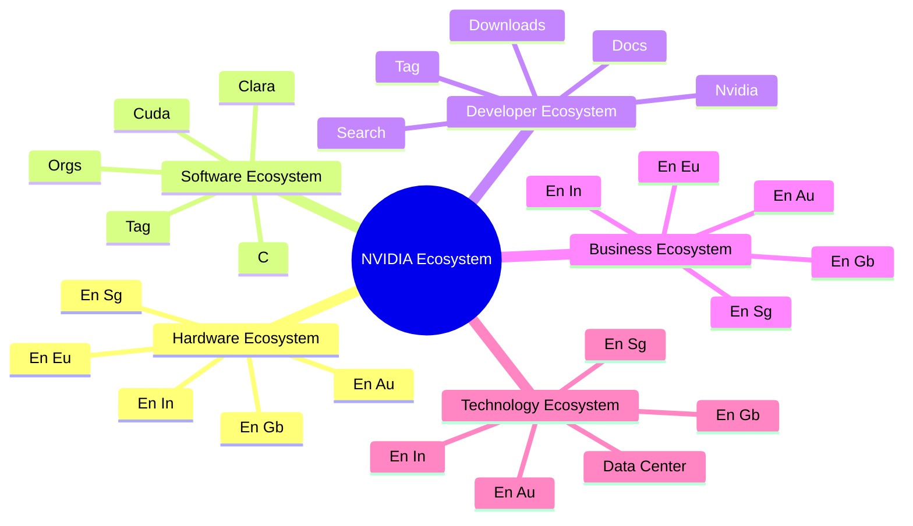
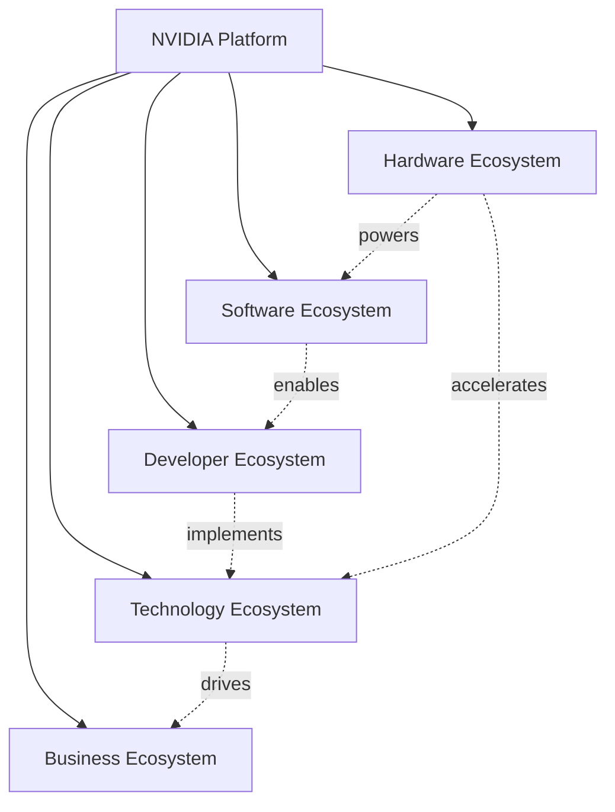
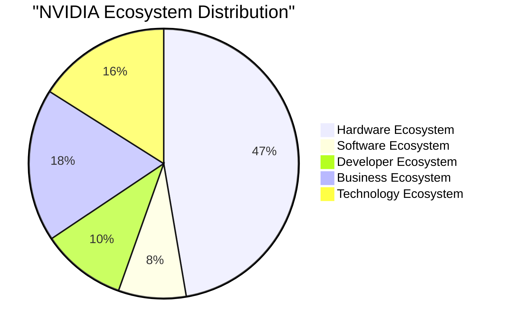

# NVIDIA Ecosystem Diagrams / NVIDIA 生态系统图表

> Generated: 2026-04-24 15:10:57

## Ecosystem Overview / 生态系统概览



## Ecosystem Relationships / 生态系统关系



## Distribution / 分布



## Product Hierarchy / 产品层级

```mermaid
mindmap
  root((NVIDIA Products))
    Automotive
      Drive Orin
      Drive orin
      Drive sim
      DRIVE Hyperion
      Drive Sim
      DRIVE ORIN
      drive thor
      Drive Thor
    Consumer GPU
      GeForce 820
      GeForce GTX 40
      GeForce RTX 5080
      GeForce RTX 4050
      RTX 1000
      RTX 5500
      GeForce   
RTX 3070
      RTX 3090 TI
    DGX Systems
      DGX station
      DGX STATION
      DGX SUPERPOD
      DGX Superpod
      DGX Cloud
      DGX SuperPOD
      DGX SuperPod
      DGX Station
    Data Center GPU
      Tesla v100
      h100
      TESLA V100
      Tesla K10
      Tesla K20
      Tesla V100
      a100
      B100
    Data Center Platform
      Grace CPU
      Grace Hopper
    Edge AI / Embedded
      jetson orin
      JEtson nano
      jetson agx xavier
      jetson agx orin
      Jetson Orin
      Jetson Xavier
      jetson Xavier
      JETSON ORIN
    Networking
      Connectx-3
      connectX
      ConnectX-6
      spectrum
      Spectrum-3
      Spectrum
      bluefield-4
      connectx-5
    Other Hardware
      B200
      L4
      l4
      b200
      H200
      h200
    Professional GPU
      Quadro K5000
      Quadro P520
      Quadro K5100
      Quadro P500
      Quadro P2200
      Quadro P3000
      Quadro P4200
      Quadro P1000
```

## Technology Stack / 技术栈

```mermaid
mindmap
  root((NVIDIA Software))
    AI Frameworks
      NeMo for
      RAPIDS cuGraph
      RAPIDS 
Available
      NeMo  You
      RAPIDS accelerated
      nemo guardrails
      NeMo enables
      rapids topics
    AI Inference
      tensorrt 10.8
      tensorrt 8.6
      NGC TensorRT
      Morpheus Triton
      Triton Inference Server
      TensorRT 8.5
      TRITON server
      TensorRT 10.0
    CUDA Platform
      CUDA 11.6
      cuda 12.9
      CUDA 8.0
      CUDA 387.128
      CUDA 5.0
      CUDA 12.8
      CUDA 11.8
      CUDA 11.7
    Cloud & Containers
      NGC is
      NGC Containers
      NGC Network
      NGC Portal
      NGC also
      NGC login
      NGC
A
      NGC Command
    Computer Vision
      DeepStream container
      deepstream and
      Metropolis puede
      Metropolis platform
      DeepStream not
      Deepstream Python
      DeepStream SGIE
      Deepstream branch
    Graphics Technology
      ray tracing
      DLSS 4
      ray Tracing
      Ray tracing
      dlss 1
      DLSS
      Ray Tracing
      DLSS 4
    Healthcare AI
      Clara is
      Clara integrates
      Clara ParabricksEnglishGenome
      Clara para
      CLARA
Uniwersalna
      CLARA PARABRICKS
      Clara SDK
      clara to
    Interconnect Technology
      NVSwitch
      NVlink
      Nvlink
      nvswitch
      NVLINK
      NVLink
      NVSWITCH
      nvlink
    Omniverse Platform
      omniverse USD
      Omniverse License
      Omniverse 
Mcity
      Omniverse sample
      Omniverse Applications
      Omniverse portfolio
      Omniverse son
      omniverse usd
    Other Software
      Base Command
      ray tracing
      Canvas
      TAO toolkit
      tao toolkit
      Tao toolkit
      canvas
      NVIDIA   
AI Enterprise
    Robotics
      Isaac


Análisis
      Isaac AI
      Isaac 
El
      ISAAC ROS
      ISAAC SIM
      Isaac VDA5050
      Isaac Nvidia
      Isaac
  3
    Speech & Audio AI
      Maxine ARSDK
      Riva server
      Riva app
      Riva Enterprise
      Riva faces
      Riva to
      Maxine partner
      Riva Learning
```
