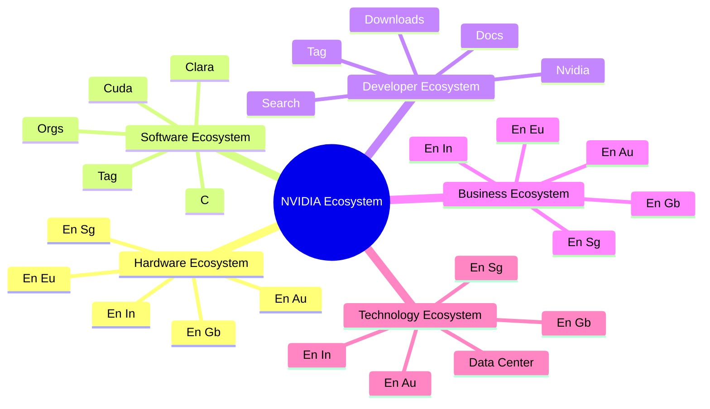
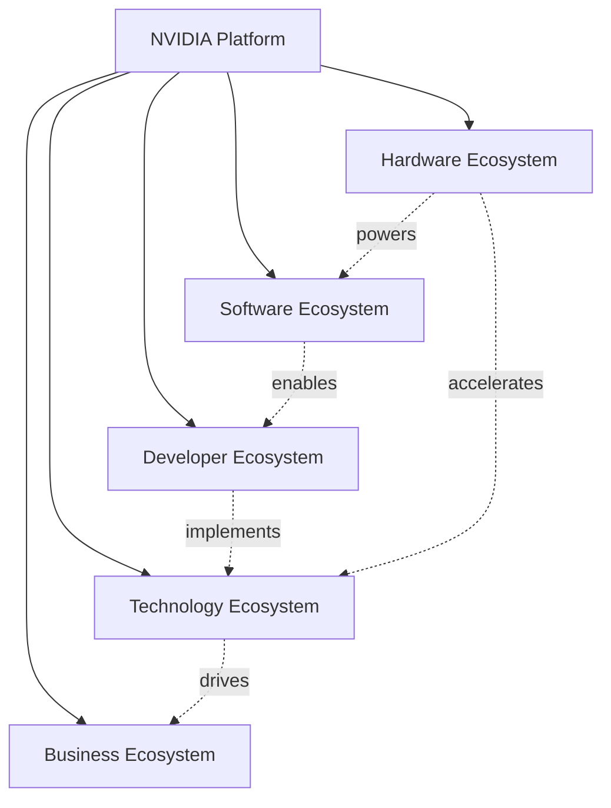
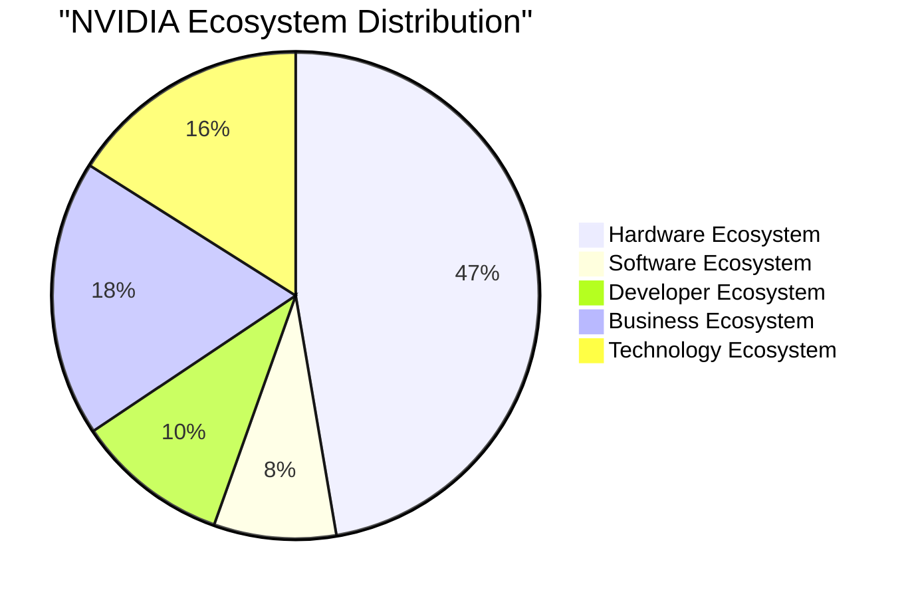

# NVIDIA Ecosystem Diagrams / NVIDIA 生态系统图表

> Generated: 2026-01-26 17:32:20

## Ecosystem Overview / 生态系统概览




## Ecosystem Relationships / 生态系统关系




## Distribution / 分布




## Product Hierarchy / 产品层级

```mermaid
mindmap
  root((NVIDIA Products))
    Automotive
      drive agx
      DRIVE ORIN
      DRIVE Hyperion
      Drive orin
      Drive AGX
      DRIVE SIM
      DRIVE Orin
      Drive Sim
    Consumer GPU
      GeForce RTX 30
      GeForce 940
      RTX 3050 Ti
      RTX 4080 Super
      GeForce 8300
      RTX  
2060 Super
      GeForce 10
      Geforce GTX 16
    DGX Systems
      DGX station
      DGX SUPERPOD
      DGX STATION
      DGX Station
      DGX Superpod
      DGX SuperPod
      DGX CLoud
      DGX Cloud
    Data Center GPU
      a100
      DGX H100
      Tesla A100
      Tesla V100
      b100
      Tesla K20
      A100
      Tesla v100
    Data Center Platform
      Grace CPU
      Grace Hopper
    Edge AI / Embedded
      Jetson AGX orin
      JETSON ORIN
      JETSON AGX Xavier
      Jetson xavier
      Jetson AGX ORIN
      jetson agx xavier
      Jetson TX2
      JETSON AGX ORIN
    Networking
      spectrum-2
      connectX-5
      connectX
      Spectrum-3
      Bluefield-3
      Connectx-7
      Connectx-6
      BlueField
    Other Hardware
      l4
      B200
      b200
      h200
      L4
      H200
    Professional GPU
      Quadro K500
      Quadro 1200
      Quadro K5200
      Quadro K600
      Quadro 5000
      Quadro K6000
      Quadro K2000
      Quadro 4000
```


## Technology Stack / 技术栈

```mermaid
mindmap
  root((NVIDIA Software))
    AI Frameworks
      NeMo 
B
      NeMo tutorials
      RAPIDS RAFT
      NeMo 
NVIDIA
      Merlin roadmap
      NeMo 
Framework
      NeMo Curator50
      nemo Q
    AI Inference
      TensorRT
  4
      triton inference server
      TensorRT 8.4
      TensorRT 10.14
      Triton inference Server
      TensorRT 8.6
      TensorRT 6.3
      TensorRT 7.2
    CUDA Platform
      CUDA 11.7
      cudnn
      CUDA 396.64
      cuDNN 8.0
      cuda 
  3
      cuda 7
      CUDNN
      CUDA 4.2
    Cloud & Containers
      NGC Login
      NGC Remove
      NGC login
      NGC
El
      NGC umożliwia
      NGC Portal
      NGC SDK
      NGC for
    Computer Vision
      Metropolis mikro
      DeepStream with
      Deepstream yolov8
      Metropolis NVIDIA
      Deepstream efficient
      Deepstream Trilogy
      DeepStream Libraries
      DeepStream 7
    Graphics Technology
      DLSS 2
      RAY TRACING
      DLSS 3
      DLSS 3
      DLSS 2
      ray tracing
      Reflex
      DLSS 4
    Healthcare AI
      clara
      Clara  
San
      CLARA for
      Clara
      CLARA
      Clara para
      Clara Parabricks
      Clara Guardian
    Interconnect Technology
      NVLINK
      NVSWITCH
      NVLink
      nvSwitch
      nvlink
      NVSwitch
      NVlink
      nvswitch
    Omniverse Platform
      Omniverse Opens
      Omniverse with
      Omniverse app
      Omniverse Plugin
      Omniverse isaac
      Omniverse Wind
      Omniverse Blueprintを活用しクラウドとAIでスケールするOmn
      OMNIVERSE LICENSING
    Other Software
      Canvas
      NVIDIA AI Enterprise
      TAO toolkit
      Base Command
      tao toolkit
      Fleet Command
      canvas
      Tao Toolkit
    Robotics
      Isaac 
The
      Isaac platforms
      Isaac ROS3
      ISAAC argus
      Isaac Dispatch
      Isaac
  3
      Isaac simulator
      ISAAC Gym
    Speech & Audio AI
      Maxine 50
      Riva Documentation
      Maxine Surveys
      Riva
Use
      NGC privata
      Riva Benchmarks
      riva conversion
      RIva para
```


