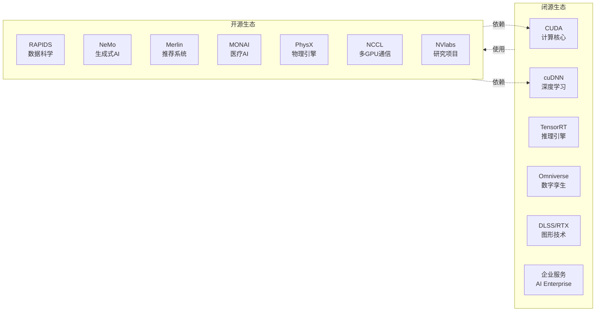
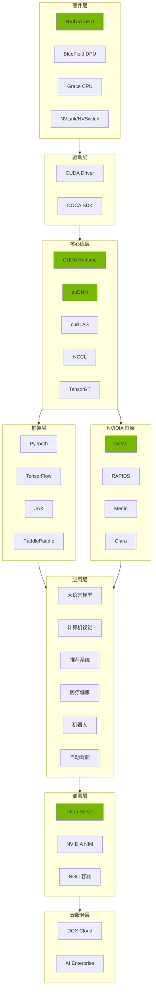

# NVIDIA 软件详细分析报告

> 按类目深度分析每个软件产品
> Generated: 2026-01-27

---

# 第一部分：闭源软件详细分析

---

## 1. 核心计算平台

### 1.1 CUDA Toolkit


| 属性       | 详情                               |
| -------- | -------------------------------- |
| **当前版本** | 12.6                             |
| **许可证**  | NVIDIA EULA (免费)                 |
| **支持平台** | Linux, Windows, macOS (仅x86)     |
| **支持架构** | sm_50 ~ sm_90 (Maxwell ~ Hopper) |


#### 核心组件

```
CUDA Toolkit
├── 编译器
│   ├── nvcc - CUDA C/C++ 编译器
│   ├── nvlink - GPU 链接器
│   ├── cuobjdump - 对象文件分析
│   └── nvdisasm - 反汇编器
├── 运行时
│   ├── CUDA Runtime API
│   ├── CUDA Driver API
│   └── NVRTC (运行时编译)
├── 调试工具
│   ├── cuda-gdb - GPU 调试器
│   ├── compute-sanitizer - 内存检查
│   └── cuda-memcheck (已弃用)
├── 性能分析
│   ├── nvprof (已弃用)
│   ├── Nsight Systems
│   └── Nsight Compute
└── 示例代码
    └── cuda-samples (GitHub 开源)
```

#### 版本演进


| 版本        | 发布年份 | 关键特性                       |
| --------- | ---- | -------------------------- |
| CUDA 1.0  | 2007 | 首发                         |
| CUDA 5.0  | 2012 | Dynamic Parallelism        |
| CUDA 7.0  | 2015 | C++11 支持                   |
| CUDA 9.0  | 2017 | Volta, Tensor Core         |
| CUDA 10.0 | 2018 | Turing                     |
| CUDA 11.0 | 2020 | Ampere, BF16               |
| CUDA 12.0 | 2023 | Hopper, Transformer Engine |
| CUDA 12.6 | 2024 | Blackwell 支持               |


#### 编程模型

```cpp
// CUDA 核心编程模型
__global__ void vectorAdd(float *a, float *b, float *c, int n) {
    int i = blockIdx.x * blockDim.x + threadIdx.x;
    if (i < n) c[i] = a[i] + b[i];
}

// 层次结构: Grid -> Block -> Thread
// 内存层次: Global -> Shared -> Register
```

---

### 1.2 cuDNN (CUDA Deep Neural Network Library)


| 属性       | 详情              |
| -------- | --------------- |
| **当前版本** | 9.5             |
| **许可证**  | NVIDIA SLA (免费) |
| **依赖**   | CUDA Toolkit    |
| **用途**   | 深度学习原语加速        |


#### 支持的操作

```
cuDNN 核心操作
├── 卷积 (Convolution)
│   ├── Forward Convolution
│   ├── Backward Data
│   ├── Backward Filter
│   ├── Grouped Convolution
│   └── Depthwise Convolution
├── 池化 (Pooling)
│   ├── Max Pooling
│   ├── Average Pooling
│   └── Adaptive Pooling
├── 归一化 (Normalization)
│   ├── Batch Normalization
│   ├── Layer Normalization
│   ├── Group Normalization
│   └── Instance Normalization
├── 激活函数 (Activation)
│   ├── ReLU, Leaky ReLU, ELU
│   ├── Sigmoid, Tanh
│   ├── Softmax
│   └── GELU, SiLU/Swish
├── 循环网络 (RNN)
│   ├── LSTM
│   ├── GRU
│   └── Vanilla RNN
├── 注意力机制 (Attention)
│   ├── Multi-Head Attention
│   ├── Flash Attention
│   └── Fused Attention
└── Tensor 操作
    ├── Transform
    ├── Reduce
    └── Scale/Bias
```

#### 性能优化特性


| 特性                 | 说明                    |
| ------------------ | --------------------- |
| **Tensor Core 加速** | FP16/BF16/TF32/FP8 支持 |
| **Graph API**      | 操作图融合优化               |
| **Auto-Tuning**    | 自动选择最优算法              |
| **Kernel Fusion**  | 多操作融合执行               |
| **Memory Format**  | NHWC/NCHW 灵活布局        |


#### 框架集成


| 框架           | 集成方式                 |
| ------------ | -------------------- |
| PyTorch      | torch.backends.cudnn |
| TensorFlow   | 自动调用                 |
| JAX          | XLA 后端               |
| PaddlePaddle | 默认启用                 |
| MXNet        | 默认启用                 |


---

### 1.3 cuBLAS (CUDA Basic Linear Algebra Subroutines)


| 属性       | 详情               |
| -------- | ---------------- |
| **当前版本** | 12.6             |
| **许可证**  | NVIDIA EULA      |
| **标准**   | BLAS Level 1/2/3 |


#### API 层次

```
cuBLAS API 结构
├── cuBLAS (Legacy API)
│   ├── Level 1: 向量操作
│   │   ├── cublasSaxpy - y = ax + y
│   │   ├── cublasSdot - 点积
│   │   ├── cublasSnrm2 - 范数
│   │   └── cublasSscal - 缩放
│   ├── Level 2: 矩阵-向量操作
│   │   ├── cublasSgemv - 矩阵向量乘
│   │   ├── cublasSger - 外积
│   │   └── cublasSsymv - 对称矩阵向量乘
│   └── Level 3: 矩阵-矩阵操作
│       ├── cublasSgemm - 矩阵乘法
│       ├── cublasSsyrk - 对称秩k更新
│       └── cublaStrsm - 三角求解
├── cuBLASLt (Light API)
│   ├── 更细粒度控制
│   ├── 混合精度支持
│   ├── 分块矩阵乘法
│   └── Epilogue 融合
└── cuBLASXt (Multi-GPU)
    ├── 多 GPU 矩阵运算
    └── 自动数据分布
```

#### 精度支持


| 精度   | 输入   | 计算    | 输出        | Tensor Core |
| ---- | ---- | ----- | --------- | ----------- |
| FP64 | FP64 | FP64  | FP64      | ✗ (Ampere+) |
| FP32 | FP32 | FP32  | FP32      | TF32        |
| FP16 | FP16 | FP16  | FP16      | ✓           |
| BF16 | BF16 | BF16  | BF16      | ✓           |
| INT8 | INT8 | INT32 | INT32     | ✓           |
| FP8  | FP8  | FP32  | FP16/BF16 | ✓           |


---

### 1.4 cuFFT (CUDA Fast Fourier Transform)


| 属性       | 详情           |
| -------- | ------------ |
| **当前版本** | 12.6         |
| **许可证**  | NVIDIA EULA  |
| **支持**   | 1D/2D/3D FFT |


#### 支持的变换

```
cuFFT 变换类型
├── 复数到复数 (C2C)
│   ├── cufftExecC2C (单精度)
│   └── cufftExecZ2Z (双精度)
├── 实数到复数 (R2C)
│   ├── cufftExecR2C (单精度)
│   └── cufftExecD2Z (双精度)
├── 复数到实数 (C2R)
│   ├── cufftExecC2R (单精度)
│   └── cufftExecZ2D (双精度)
└── cuFFTMp (Multi-Process)
    ├── 多 GPU FFT
    ├── MPI 支持
    └── NVSHMEM 支持
```

#### 应用场景


| 应用   | 用途        |
| ---- | --------- |
| 信号处理 | 频谱分析、滤波   |
| 图像处理 | 卷积、去噪     |
| 科学计算 | 偏微分方程求解   |
| 金融   | 期权定价      |
| 医学影像 | CT/MRI 重建 |


---

## 2. AI 推理引擎

### 2.1 TensorRT


| 属性       | 详情                       |
| -------- | ------------------------ |
| **当前版本** | 10.5                     |
| **许可证**  | NVIDIA SLA               |
| **支持模型** | ONNX, TF, PyTorch, Caffe |


#### 架构组件

```
TensorRT 架构
├── 前端 (Parser)
│   ├── ONNX Parser
│   ├── UFF Parser (已弃用)
│   ├── Caffe Parser
│   └── TensorFlow Parser (TF-TRT)
├── 优化器 (Optimizer)
│   ├── Layer Fusion
│   │   ├── Conv + BN + ReLU
│   │   ├── FC + Activation
│   │   └── Attention Fusion
│   ├── Kernel Auto-Tuning
│   ├── Precision Calibration
│   │   ├── INT8 量化
│   │   ├── FP8 量化
│   │   └── 混合精度
│   ├── Memory Optimization
│   └── Tensor Reformatting
├── 运行时 (Runtime)
│   ├── Engine Builder
│   ├── Execution Context
│   ├── Plugin System
│   └── Dynamic Shapes
└── 工具链
    ├── trtexec - 命令行工具
    ├── Polygraphy - 调试工具
    └── ONNX-GraphSurgeon
```

#### 优化技术


| 技术                     | 说明             | 加速比      |
| ---------------------- | -------------- | -------- |
| **Layer Fusion**       | 合并多层为单一 kernel | 1.2-2x   |
| **Kernel Auto-Tuning** | 自动选择最优 kernel  | 1.1-1.5x |
| **FP16/INT8 量化**       | 降低精度提升吞吐       | 2-4x     |
| **FP8 量化**             | Hopper+ 专属     | 2-3x     |
| **Dynamic Batching**   | 动态批量处理         | 可变       |
| **Multi-Stream**       | 并行执行多流         | 1.2-1.8x |


---

### 2.2 TensorRT-LLM


| 属性       | 详情         |
| -------- | ---------- |
| **当前版本** | 0.15+      |
| **许可证**  | NVIDIA SLA |
| **用途**   | 大语言模型推理优化  |


#### 支持的模型

```
TensorRT-LLM 模型支持
├── GPT 系列
│   ├── GPT-2, GPT-J, GPT-NeoX
│   ├── LLaMA 1/2/3, LLaMA 3.1
│   ├── Mistral, Mixtral (MoE)
│   └── Falcon
├── BERT 系列
│   ├── BERT, RoBERTa
│   ├── DeBERTa
│   └── ALBERT
├── 编码器-解码器
│   ├── T5, mT5
│   ├── BART
│   └── Flan-T5
├── 多模态
│   ├── LLaVA
│   ├── BLIP-2
│   └── Qwen-VL
└── 国产模型
    ├── ChatGLM 1/2/3/4
    ├── Qwen 1/2
    ├── Baichuan 1/2
    └── InternLM
```

#### 核心优化技术


| 技术                       | 说明            |
| ------------------------ | ------------- |
| **In-flight Batching**   | 动态批处理，无需等待    |
| **Paged KV Cache**       | 类似 vLLM 的分页缓存 |
| **Tensor Parallelism**   | 多 GPU 张量并行    |
| **Pipeline Parallelism** | 多 GPU 流水线并行   |
| **FP8 Quantization**     | Hopper 专属 FP8 |
| **INT4/AWQ/GPTQ**        | 低比特量化         |
| **Speculative Decoding** | 推测解码加速        |
| **KV Cache Reuse**       | 前缀缓存复用        |


#### 性能数据 (H100)


| 模型           | 批大小 | 吞吐量 (tokens/s) |
| ------------ | --- | -------------- |
| LLaMA-2 7B   | 1   | 4,500+         |
| LLaMA-2 70B  | 1   | 800+           |
| Mixtral 8x7B | 1   | 1,200+         |
| GPT-3 175B   | 1   | 300+           |


---

## 3. 图形技术

### 3.1 DLSS (Deep Learning Super Sampling)


| 属性       | 详情                 |
| -------- | ------------------ |
| **当前版本** | DLSS 3.5           |
| **许可证**  | Proprietary        |
| **硬件要求** | RTX 20/30/40/50 系列 |


#### 版本演进

```
DLSS 版本历史
├── DLSS 1.0 (2019)
│   └── 固定模型，游戏专用训练
├── DLSS 2.0 (2020)
│   ├── 通用模型，无需游戏专训
│   ├── 质量/平衡/性能/极限性能模式
│   └── 时间稳定性大幅提升
├── DLSS 3.0 (2022, RTX 40)
│   ├── Frame Generation (帧生成)
│   ├── 光流加速器
│   └── 最高 4x 帧率提升
├── DLSS 3.5 (2023)
│   ├── Ray Reconstruction (光追重建)
│   ├── 替代传统降噪器
│   └── 光追画质大幅提升
└── DLSS 4.0 (2025, RTX 50)
    ├── Multi Frame Generation
    ├── Transformer 架构
    └── 最高生成 3 帧
```

#### 技术原理


| 组件                     | 输入                | 输出    | 说明      |
| ---------------------- | ----------------- | ----- | ------- |
| **Super Resolution**   | 低分辨率帧 + 运动向量 + 深度 | 高分辨率帧 | AI 超分辨率 |
| **Frame Generation**   | 前后帧 + 光流          | 插值帧   | 帧率倍增    |
| **Ray Reconstruction** | 带噪声光追数据           | 降噪结果  | 替代降噪器   |


---

### 3.2 RTX 技术栈

```
RTX 技术体系
├── 硬件加速单元
│   ├── RT Core (光追核心)
│   │   ├── BVH 遍历加速
│   │   ├── 光线-三角形求交
│   │   └── 第 3/4 代 RT Core
│   ├── Tensor Core (张量核心)
│   │   ├── DLSS 推理
│   │   ├── 降噪
│   │   └── 第 4/5 代 Tensor Core
│   └── Optical Flow Accelerator
│       └── DLSS 帧生成
├── 软件 API
│   ├── DirectX Raytracing (DXR)
│   ├── Vulkan Ray Tracing
│   └── OptiX
├── 渲染技术
│   ├── 光线追踪
│   │   ├── 反射 (Reflections)
│   │   ├── 阴影 (Shadows)
│   │   ├── 全局光照 (GI)
│   │   └── 环境光遮蔽 (AO)
│   ├── 路径追踪 (Path Tracing)
│   └── ReSTIR (重要性采样)
└── 集成工具
    ├── Streamline SDK
    ├── RTX Remix
    └── Neural Texture Compression
```

---

### 3.3 OptiX


| 属性       | 详情          |
| -------- | ----------- |
| **当前版本** | 8.1         |
| **许可证**  | NVIDIA EULA |
| **用途**   | 专业光追开发      |


#### 架构

```
OptiX 架构
├── 核心组件
│   ├── Context - 执行上下文
│   ├── Module - CUDA 程序模块
│   ├── Program Group - 着色器组
│   └── Pipeline - 执行管线
├── 着色器类型
│   ├── Ray Generation - 光线生成
│   ├── Intersection - 自定义求交
│   ├── Any Hit - 任意命中
│   ├── Closest Hit - 最近命中
│   ├── Miss - 未命中
│   └── Callable - 可调用程序
├── 加速结构
│   ├── GAS (Geometry AS)
│   ├── IAS (Instance AS)
│   └── Motion Blur 支持
└── 内置功能
    ├── AI Denoiser
    ├── Motion Blur
    └── Curve/Hair 渲染
```

#### 应用领域


| 领域    | 应用软件                    |
| ----- | ----------------------- |
| 影视渲染  | Arnold, V-Ray, Redshift |
| 建筑可视化 | Enscape, Lumion         |
| 产品设计  | KeyShot, VRED           |
| 游戏开发  | Unreal Engine           |
| 科学可视化 | ParaView                |


---

### 3.4 Reflex


| 属性       | 详情          |
| -------- | ----------- |
| **当前版本** | 2.0         |
| **许可证**  | Proprietary |
| **用途**   | 降低输入延迟      |


#### 技术原理

```
Reflex 延迟优化
├── 渲染队列管理
│   ├── 消除渲染队列堆积
│   ├── Just-in-Time 帧提交
│   └── CPU-GPU 同步优化
├── 延迟测量
│   ├── Reflex Latency Analyzer
│   ├── 端到端延迟测量
│   └── 需要兼容显示器
└── 集成方式
    ├── 游戏引擎插件
    ├── Streamline SDK
    └── DirectX/Vulkan API
```

#### 延迟对比


| 场景     | 无 Reflex | 有 Reflex | 降低  |
| ------ | -------- | -------- | --- |
| CPU 限制 | 50ms     | 25ms     | 50% |
| GPU 限制 | 40ms     | 30ms     | 25% |
| 平衡负载   | 35ms     | 20ms     | 43% |


---

## 4. 平台产品

### 4.1 Omniverse


| 属性      | 详情                 |
| ------- | ------------------ |
| **许可证** | Proprietary (企业收费) |
| **用途**  | 3D 协作与数字孪生         |


#### 平台架构

```
Omniverse 架构
├── 核心服务
│   ├── Nucleus
│   │   ├── 协作服务器
│   │   ├── 版本控制
│   │   ├── 权限管理
│   │   └── 资产数据库
│   ├── USD (Universal Scene Description)
│   │   ├── 场景图表示
│   │   ├── 层级组合
│   │   └── 变体管理
│   └── RTX Renderer
│       ├── 实时光追
│       ├── 路径追踪
│       └── PhysX 集成
├── 应用程序
│   ├── USD Composer
│   │   └── 3D 场景创作
│   ├── USD Presenter
│   │   └── 交互式展示
│   ├── Audio2Face
│   │   └── 音频驱动面部
│   ├── Machinima
│   │   └── 动画制作
│   └── View
│       └── 场景查看
├── 开发平台
│   ├── Kit SDK
│   │   ├── 扩展框架
│   │   ├── Python API
│   │   └── UI 框架
│   └── Extensions
│       └── 200+ 官方扩展
├── 连接器
│   ├── Autodesk (Maya, 3ds Max, Revit)
│   ├── Blender
│   ├── SketchUp
│   ├── Unreal Engine
│   ├── Unity
│   └── PTC Creo
└── 工具
    ├── Replicator (合成数据)
    ├── Farm Queue (渲染农场)
    └── DeepSearch (AI 搜索)
```

#### 定价模式


| 版本             | 价格   | 功能        |
| -------------- | ---- | --------- |
| **Individual** | 免费   | 基础功能      |
| **Enterprise** | 订阅制  | 完整功能 + 支持 |
| **Cloud**      | 按需计费 | 云端渲染      |


---

### 4.2 Isaac Sim


| 属性      | 详情          |
| ------- | ----------- |
| **许可证** | Proprietary |
| **基础**  | Omniverse   |
| **用途**  | 机器人仿真       |


#### 功能模块

```
Isaac Sim 功能
├── 物理仿真
│   ├── PhysX 5.x
│   │   ├── 刚体动力学
│   │   ├── 关节系统
│   │   └── 碰撞检测
│   ├── 软体仿真
│   ├── 流体仿真
│   └── 布料仿真
├── 传感器仿真
│   ├── 相机 (RGB/深度/语义)
│   ├── LiDAR
│   │   ├── 旋转式
│   │   ├── 固态
│   │   └── 点云生成
│   ├── IMU
│   ├── 超声波
│   └── 接触传感器
├── 机器人支持
│   ├── 机械臂 (UR, Franka, Kinova)
│   ├── AMR (移动机器人)
│   ├── 四足机器人
│   └── 人形机器人
├── AI 集成
│   ├── Isaac Lab (RL 训练)
│   ├── 域随机化
│   └── Sim2Real 迁移
└── ROS 集成
    ├── ROS 2 Bridge
    ├── Isaac ROS 加速
    └── 导航栈
```

#### 仿真性能


| 场景     | 机器人数量 | 帧率 (FPS) |
| ------ | ----- | -------- |
| 仓库 AMR | 100+  | 60+      |
| 机械臂操作  | 10    | 60+      |
| 人形机器人  | 1     | 30+      |


---

### 4.3 DRIVE 平台


| 属性      | 详情         |
| ------- | ---------- |
| **许可证** | Commercial |
| **用途**  | 自动驾驶开发     |


#### 平台组成

```
DRIVE 平台架构
├── 硬件 (SoC)
│   ├── DRIVE Orin (254 TOPS)
│   │   ├── Ampere GPU
│   │   ├── Arm CPU
│   │   └── DLA 加速器
│   └── DRIVE Thor (2000 TOPS)
│       ├── Blackwell GPU
│       └── 下一代 SoC
├── 操作系统
│   └── DRIVE OS
│       ├── Linux 基础
│       ├── 功能安全 (ASIL-D)
│       └── Hypervisor
├── 中间件
│   └── DriveWorks SDK
│       ├── 传感器处理
│       │   ├── 相机
│       │   ├── LiDAR
│       │   └── Radar
│       ├── 感知模块
│       ├── 定位模块
│       └── 规划模块
├── 软件栈
│   ├── DRIVE AV
│   │   ├── 感知
│   │   ├── 预测
│   │   ├── 规划
│   │   └── 控制
│   └── DRIVE IX
│       ├── 驾驶员监控
│       ├── 座舱 AI
│       └── 语音助手
├── 仿真
│   └── DRIVE Sim
│       ├── Omniverse 基础
│       ├── 传感器仿真
│       └── 交通仿真
└── 高精地图
    └── DRIVE Mapping
        ├── 众包建图
        └── 实时更新
```

---

## 5. 语音 AI

### 5.1 Riva SDK


| 属性      | 详情              |
| ------- | --------------- |
| **许可证** | Commercial      |
| **部署**  | On-Prem / Cloud |


#### 功能组件

```
Riva SDK 架构
├── 语音识别 (ASR)
│   ├── 流式识别
│   ├── 批量识别
│   ├── 模型
│   │   ├── Conformer
│   │   ├── Parakeet (最新)
│   │   └── Citrinet
│   ├── 语言支持 (20+)
│   └── 自定义词汇
├── 语音合成 (TTS)
│   ├── 模型
│   │   ├── FastPitch
│   │   ├── RadTTS
│   │   └── VITS
│   ├── 声码器
│   │   ├── HiFi-GAN
│   │   └── UnivNet
│   └── 自定义声音
├── 神经机器翻译 (NMT)
│   ├── 实时翻译
│   └── 多语言支持
├── 自然语言处理 (NLP)
│   ├── 意图识别
│   ├── 实体提取
│   └── 情感分析
└── 部署方式
    ├── Riva Skills
    ├── gRPC API
    ├── Triton 后端
    └── Kubernetes
```

#### 性能指标


| 功能       | 延迟      | 精度       |
| -------- | ------- | -------- |
| ASR (流式) | < 300ms | WER 5-8% |
| TTS      | < 100ms | MOS 4.2+ |
| NMT      | < 200ms | BLEU 35+ |


---

### 5.2 Maxine SDK


| 属性      | 详情          |
| ------- | ----------- |
| **许可证** | Proprietary |
| **用途**  | 视频会议 AI     |


#### 功能模块

```
Maxine SDK 功能
├── 视频效果 (Video Effects)
│   ├── 背景模糊/替换
│   ├── 虚拟背景
│   ├── 自动取景
│   ├── 视线校正 (Eye Contact)
│   └── 超分辨率
├── 音频效果 (Audio Effects)
│   ├── 噪声消除
│   ├── 回声消除
│   ├── 语音增强
│   └── 房间回声抑制
├── 增强现实 (AR SDK)
│   ├── 面部追踪
│   ├── 3D 面部网格
│   ├── 表情追踪
│   ├── 眼动追踪
│   └── 手部追踪
└── 视频编解码
    ├── 超低码率压缩
    └── AI 视频编码
```

#### 应用场景


| 场景   | 功能       |
| ---- | -------- |
| 视频会议 | 背景、降噪、眼神 |
| 直播   | 美颜、滤镜    |
| 远程医疗 | 高清视频     |
| 客服中心 | 语音增强     |


---

## 6. 企业云服务

### 6.1 AI Enterprise


| 属性      | 详情  |
| ------- | --- |
| **许可证** | 订阅制 |
| **版本**  | 5.x |


#### 组件堆栈

```
AI Enterprise 组件
├── 基础设施层
│   ├── vGPU 软件
│   │   ├── vCS (虚拟计算服务器)
│   │   ├── vWS (虚拟工作站)
│   │   └── vApps (虚拟应用)
│   ├── GPU Operator
│   │   ├── Kubernetes 集成
│   │   ├── 自动驱动管理
│   │   └── 设备插件
│   └── MIG (Multi-Instance GPU)
│       └── GPU 分区隔离
├── AI 软件层
│   ├── 容器 (NGC)
│   │   ├── PyTorch
│   │   ├── TensorFlow
│   │   ├── RAPIDS
│   │   └── Triton
│   ├── AI Workflows
│   │   ├── 对话式 AI
│   │   ├── 数字人
│   │   └── 网络安全
│   └── NIM 微服务
├── 平台层
│   ├── VMware vSphere
│   ├── Red Hat OpenShift
│   ├── Kubernetes
│   └── 云平台 (AWS/Azure/GCP)
└── 支持服务
    ├── 企业级支持
    ├── 安全更新
    └── 认证兼容性
```

#### 定价


| 级别             | 价格 (年)     | 内容          |
| -------------- | ---------- | ----------- |
| **Standard**   | $4,500/GPU | 基础软件 + 支持   |
| **Enterprise** | $8,500/GPU | 全部功能 + 高级支持 |


---

### 6.2 DGX Cloud


| 属性       | 详情                         |
| -------- | -------------------------- |
| **类型**   | AI 超级计算云服务                 |
| **合作伙伴** | Azure, GCP, Oracle, Lambda |


#### 服务层次

```
DGX Cloud 服务
├── 计算资源
│   ├── DGX H100 实例
│   │   ├── 8x H100 80GB
│   │   ├── NVLink 4.0
│   │   └── 640GB GPU 内存
│   ├── DGX B200 实例 (新)
│   │   └── 8x B200
│   └── 按需扩展
├── 存储
│   ├── 高性能 NVMe
│   ├── 对象存储
│   └── 共享文件系统
├── 网络
│   ├── InfiniBand 400Gb
│   └── 低延迟互连
├── 软件
│   ├── Base Command Platform
│   ├── NGC 容器
│   ├── NeMo Framework
│   └── 预置工作流
└── 托管服务
    ├── 专用集群
    ├── 共享资源池
    └── Serverless 推理
```

#### 定价模式


| 资源          | 价格         | 说明      |
| ----------- | ---------- | ------- |
| DGX H100 节点 | ~$37,000/月 | 8x H100 |
| 存储          | 按 TB 计费    |         |
| 支持          | 包含         | 企业级     |


---

### 6.3 NGC (NVIDIA GPU Cloud)


| 属性     | 详情       |
| ------ | -------- |
| **类型** | 容器与模型目录  |
| **访问** | 免费 + 企业版 |


#### 目录内容

```
NGC 目录
├── 容器 (500+)
│   ├── 深度学习框架
│   │   ├── PyTorch
│   │   ├── TensorFlow
│   │   ├── JAX
│   │   └── MXNet
│   ├── AI 工具
│   │   ├── TensorRT
│   │   ├── Triton
│   │   ├── RAPIDS
│   │   └── NeMo
│   ├── HPC
│   │   ├── GROMACS
│   │   ├── LAMMPS
│   │   ├── NAMD
│   │   └── Quantum ESPRESSO
│   └── 行业方案
│       ├── Clara
│       ├── Isaac
│       └── Metropolis
├── 模型 (1000+)
│   ├── LLM
│   │   ├── Nemotron
│   │   ├── LLaMA
│   │   └── Mistral
│   ├── CV 模型
│   │   ├── ResNet
│   │   ├── EfficientNet
│   │   └── YOLO
│   ├── 语音模型
│   │   ├── Parakeet
│   │   └── FastPitch
│   └── 推荐模型
├── Helm Charts
│   ├── Triton 部署
│   ├── RAPIDS 部署
│   └── 监控工具
└── 资源
    ├── Jupyter Notebooks
    ├── 教程
    └── 最佳实践
```

---

# 第二部分：开源软件详细分析

---

## 7. 数据科学 - RAPIDS


| 属性         | 详情                  |
| ---------- | ------------------- |
| **许可证**    | Apache 2.0          |
| **GitHub** | github.com/rapidsai |
| **Stars**  | 10,000+ (全系列)       |


### 组件详解

```
RAPIDS 生态系统
├── cuDF (数据帧)
│   ├── pandas-like API
│   ├── Apache Arrow 格式
│   ├── 10-100x 加速
│   └── Dask-cuDF 分布式
├── cuML (机器学习)
│   ├── 分类
│   │   ├── RandomForest
│   │   ├── SVM
│   │   ├── LogisticRegression
│   │   └── KNN
│   ├── 回归
│   │   ├── LinearRegression
│   │   ├── Ridge/Lasso
│   │   └── ElasticNet
│   ├── 聚类
│   │   ├── K-Means
│   │   ├── DBSCAN
│   │   └── HDBSCAN
│   ├── 降维
│   │   ├── PCA
│   │   ├── UMAP
│   │   └── t-SNE
│   └── 时间序列
│       └── ARIMA
├── cuGraph (图分析)
│   ├── 图算法
│   │   ├── PageRank
│   │   ├── BFS/DFS
│   │   ├── SSSP (最短路径)
│   │   ├── Connected Components
│   │   └── Triangle Count
│   ├── 社区检测
│   │   ├── Louvain
│   │   └── Spectral Clustering
│   └── 链接预测
├── cuVS (向量搜索)
│   ├── 算法
│   │   ├── IVF-Flat
│   │   ├── IVF-PQ
│   │   ├── CAGRA (最快)
│   │   └── HNSW
│   ├── 亿级向量支持
│   └── Milvus/Faiss 集成
├── cuSpatial (空间分析)
│   ├── 点线面操作
│   ├── 轨迹分析
│   └── 空间连接
└── cuSignal (信号处理)
    ├── 滤波
    ├── 频谱分析
    └── 小波变换
```

### 性能对比


| 任务            | pandas/sklearn | RAPIDS | 加速比 |
| ------------- | -------------- | ------ | --- |
| CSV 读取        | 60s            | 2s     | 30x |
| GroupBy 聚合    | 45s            | 0.8s   | 56x |
| K-Means (1M点) | 120s           | 3s     | 40x |
| UMAP (100K点)  | 300s           | 5s     | 60x |
| PageRank      | 180s           | 2s     | 90x |


---

## 8. 生成式 AI - NeMo


| 属性         | 详情                     |
| ---------- | ---------------------- |
| **许可证**    | Apache 2.0             |
| **GitHub** | github.com/NVIDIA/NeMo |
| **Stars**  | 12,000+                |


### 组件详解

```
NeMo Framework
├── NeMo Core
│   ├── Neural Modules (NM)
│   ├── Neural Types
│   ├── Trainer (PyTorch Lightning)
│   └── 配置系统 (Hydra)
├── NeMo LLM
│   ├── 模型架构
│   │   ├── GPT
│   │   ├── LLaMA
│   │   ├── Falcon
│   │   └── Mixtral (MoE)
│   ├── 训练
│   │   ├── 预训练
│   │   ├── SFT (有监督微调)
│   │   ├── RLHF
│   │   └── DPO
│   └── 并行策略
│       ├── Tensor Parallelism
│       ├── Pipeline Parallelism
│       ├── Sequence Parallelism
│       └── Expert Parallelism
├── NeMo Curator
│   ├── 数据清洗
│   ├── 去重
│   ├── 质量过滤
│   └── PII 移除
├── NeMo Guardrails
│   ├── 输入过滤
│   ├── 输出过滤
│   ├── 话题限制
│   └── 事实检查
├── NeMo Customizer
│   ├── LoRA
│   ├── P-Tuning
│   ├── Adapter
│   └── 全量微调
├── NeMo ASR
│   ├── Conformer
│   ├── Citrinet
│   ├── Parakeet
│   └── 流式 ASR
├── NeMo TTS
│   ├── FastPitch
│   ├── RadTTS
│   ├── VITS
│   └── 多语言支持
└── NeMo Multimodal
    ├── NeVA (视觉)
    ├── CLIP
    └── Stable Diffusion
```

### 预训练模型


| 模型              | 参数量  | 用途     |
| --------------- | ---- | ------ |
| Nemotron-4 340B | 340B | 基座 LLM |
| Nemotron-4 15B  | 15B  | 轻量 LLM |
| Parakeet-CTC    | -    | ASR    |
| FastPitch       | -    | TTS    |


---

## 9. 推荐系统 - Merlin


| 属性         | 详情                       |
| ---------- | ------------------------ |
| **许可证**    | Apache 2.0               |
| **GitHub** | github.com/NVIDIA/Merlin |


### 组件详解

```
Merlin 推荐系统
├── NVTabular
│   ├── 特征工程
│   │   ├── 分类编码
│   │   ├── 数值归一化
│   │   ├── 交叉特征
│   │   └── 序列特征
│   ├── 数据加载
│   │   ├── Parquet
│   │   ├── CSV
│   │   └── Criteo 格式
│   └── 分布式处理
├── HugeCTR
│   ├── 嵌入层
│   │   ├── 分布式嵌入
│   │   ├── 动态嵌入
│   │   └── 万亿级支持
│   ├── 模型架构
│   │   ├── DLRM
│   │   ├── DeepFM
│   │   ├── DCN v2
│   │   └── Wide & Deep
│   ├── 训练优化
│   │   ├── 混合精度
│   │   ├── 多 GPU
│   │   └── 异步训练
│   └── 在线学习
├── Transformers4Rec
│   ├── 序列推荐
│   │   ├── Transformer-XL
│   │   ├── XLNet
│   │   └── GPT-2
│   ├── 会话推荐
│   └── 多任务学习
├── Merlin Models
│   ├── 预置模型
│   │   ├── Two-Tower
│   │   ├── Matrix Factorization
│   │   └── DLRM
│   └── TensorFlow/PyTorch
├── Merlin Systems
│   ├── 端到端推理
│   ├── Triton 集成
│   └── 特征存储
└── Sparse Operation Kit (SOK)
    ├── TensorFlow 嵌入
    └── 分布式训练
```

### 性能数据


| 场景      | CPU     | Merlin GPU | 加速比 |
| ------- | ------- | ---------- | --- |
| 特征工程    | 2小时     | 5分钟        | 24x |
| DLRM 训练 | 10小时    | 20分钟       | 30x |
| 推理吞吐    | 10K QPS | 500K QPS   | 50x |


---

## 10. 医疗 AI - MONAI


| 属性         | 详情                       |
| ---------- | ------------------------ |
| **许可证**    | Apache 2.0               |
| **GitHub** | github.com/Project-MONAI |
| **Stars**  | 5,500+                   |


### 组件详解

```
MONAI 生态系统
├── MONAI Core
│   ├── 数据处理
│   │   ├── 医学图像加载 (NIfTI, DICOM)
│   │   ├── 数据增强
│   │   └── 采样策略
│   ├── 网络架构
│   │   ├── UNet / UNet++
│   │   ├── SegResNet
│   │   ├── SwinUNETR
│   │   ├── UNETR
│   │   └── nnUNet
│   ├── 损失函数
│   │   ├── Dice Loss
│   │   ├── Focal Loss
│   │   └── Tversky Loss
│   └── 评估指标
│       ├── Dice Score
│       ├── Hausdorff Distance
│       └── Surface Distance
├── MONAI Label
│   ├── 交互式标注
│   ├── 主动学习
│   ├── AI 辅助标注
│   └── 3D Slicer/OHIF 集成
├── MONAI Deploy
│   ├── 推理管线
│   ├── MAP (应用包)
│   ├── 工作流引擎
│   └── 合规打包
├── MONAI Bundles
│   ├── 预训练模型
│   │   ├── 肺分割
│   │   ├── 肿瘤检测
│   │   ├── 器官分割
│   │   └── 心脏分析
│   └── 模型市场
└── MONAI FL (联邦学习)
    └── NVFlare 集成
```

### 应用领域


| 领域  | 任务     | 模型        |
| --- | ------ | --------- |
| 放射科 | CT 肺分割 | SegResNet |
| 放射科 | 肿瘤检测   | SwinUNETR |
| 病理科 | 细胞分割   | HoVerNet  |
| 心脏科 | 心脏分割   | UNETR     |
| 眼科  | 视网膜分析  | UNet      |


---

## 11. 通信/并行库

### 11.1 NCCL


| 属性         | 详情                     |
| ---------- | ---------------------- |
| **许可证**    | BSD                    |
| **GitHub** | github.com/NVIDIA/nccl |


```
NCCL 集合操作
├── AllReduce
│   └── 所有进程求和并广播
├── Broadcast
│   └── 单进程广播到所有
├── Reduce
│   └── 所有进程规约到单一
├── AllGather
│   └── 收集所有数据到所有
├── ReduceScatter
│   └── 规约后分散
└── Send/Recv
    └── 点对点通信
```

### 11.2 Thrust / CUB

```
Thrust 算法
├── 变换 (Transform)
│   ├── transform
│   ├── for_each
│   └── tabulate
├── 规约 (Reduce)
│   ├── reduce
│   ├── reduce_by_key
│   └── count
├── 前缀和 (Scan)
│   ├── inclusive_scan
│   ├── exclusive_scan
│   └── scan_by_key
├── 排序 (Sort)
│   ├── sort
│   ├── sort_by_key
│   └── stable_sort
└── 其他
    ├── copy
    ├── fill
    ├── unique
    └── set_operations
```

---

## 12. 物理引擎 - PhysX


| 属性         | 详情                                |
| ---------- | --------------------------------- |
| **许可证**    | BSD 3-Clause                      |
| **GitHub** | github.com/NVIDIA-Omniverse/PhysX |
| **版本**     | 5.x                               |


```
PhysX 5.x 功能
├── 刚体动力学
│   ├── 碰撞检测
│   ├── 约束求解
│   ├── 连续碰撞
│   └── 关节系统
├── 软体仿真
│   ├── 有限元方法 (FEM)
│   ├── 可变形体
│   └── 实时切割
├── 布料仿真
│   ├── 自碰撞
│   ├── 撕裂
│   └── 风力
├── 流体仿真
│   ├── PBD 方法
│   ├── SPH
│   └── 表面重建
├── 车辆仿真
│   ├── 轮胎模型
│   ├── 悬挂系统
│   └── 传动系统
└── GPU 加速
    ├── 刚体 GPU
    ├── 布料 GPU
    └── 流体 GPU
```

---

## 13. 研究项目 (NVlabs)

### 13.1 instant-ngp


| 属性         | 详情                            |
| ---------- | ----------------------------- |
| **许可证**    | MIT (非商业)                     |
| **GitHub** | github.com/NVlabs/instant-ngp |
| **Stars**  | 16,000+                       |


```
instant-ngp 特性
├── 核心技术
│   ├── Multi-resolution Hash Encoding
│   ├── 全连接网络
│   └── CUDA 实现
├── 应用场景
│   ├── NeRF (神经辐射场)
│   ├── SDF (有符号距离场)
│   ├── Neural Images
│   └── Neural Volumes
└── 性能
    ├── 训练: 5-10 秒
    ├── 渲染: 实时 (60+ FPS)
    └── 内存: < 50MB
```

### 13.2 StyleGAN3


| 属性         | 详情                          |
| ---------- | --------------------------- |
| **许可证**    | NVIDIA Source Code License  |
| **GitHub** | github.com/NVlabs/stylegan3 |


```
StyleGAN 演进
├── StyleGAN (2018)
│   └── 风格控制
├── StyleGAN2 (2019)
│   ├── 去除伪影
│   └── 渐进式训练
├── StyleGAN3 (2021)
│   ├── 别名消除
│   ├── 平移等变性
│   └── 旋转等变性
└── StyleGAN-T (2023)
    └── 文本条件生成
```

### 13.3 nvdiffrast


| 属性      | 详情    |
| ------- | ----- |
| **许可证** | MIT   |
| **用途**  | 可微分渲染 |


```
nvdiffrast 功能
├── 光栅化
│   ├── 前向渲染
│   └── 反向传播
├── 插值
│   ├── 属性插值
│   └── 梯度传播
├── 抗锯齿
│   └── 可微分 AA
└── 集成
    ├── PyTorch
    └── TensorFlow
```

---

# 第三部分：统计汇总

## 开源 vs 闭源对比




## 完整软件清单


| 序号  | 软件               | 类别    | 许可证            | 状态  |
| --- | ---------------- | ----- | -------------- | --- |
| 1   | CUDA Toolkit     | 核心计算  | NVIDIA EULA    | 闭源  |
| 2   | cuDNN            | 核心计算  | NVIDIA SLA     | 闭源  |
| 3   | cuBLAS           | 核心计算  | NVIDIA EULA    | 闭源  |
| 4   | cuFFT            | 核心计算  | NVIDIA EULA    | 闭源  |
| 5   | TensorRT         | AI推理  | NVIDIA SLA     | 闭源  |
| 6   | TensorRT-LLM     | AI推理  | NVIDIA SLA     | 闭源  |
| 7   | DLSS             | 图形技术  | Proprietary    | 闭源  |
| 8   | RTX              | 图形技术  | Proprietary    | 闭源  |
| 9   | OptiX            | 图形技术  | NVIDIA EULA    | 闭源  |
| 10  | Reflex           | 图形技术  | Proprietary    | 闭源  |
| 11  | Omniverse        | 平台    | Proprietary    | 闭源  |
| 12  | Isaac Sim        | 平台    | Proprietary    | 闭源  |
| 13  | DRIVE            | 平台    | Commercial     | 闭源  |
| 14  | Riva SDK         | 语音AI  | Commercial     | 闭源  |
| 15  | Maxine SDK       | 语音AI  | Proprietary    | 闭源  |
| 16  | AI Enterprise    | 企业云   | Commercial     | 闭源  |
| 17  | DGX Cloud        | 企业云   | Commercial     | 闭源  |
| 18  | NGC              | 企业云   | Service        | 混合  |
| 19  | cuDF             | 数据科学  | Apache 2.0     | 开源  |
| 20  | cuML             | 数据科学  | Apache 2.0     | 开源  |
| 21  | cuGraph          | 数据科学  | Apache 2.0     | 开源  |
| 22  | cuVS             | 数据科学  | Apache 2.0     | 开源  |
| 23  | NeMo Framework   | 生成式AI | Apache 2.0     | 开源  |
| 24  | NeMo Guardrails  | 生成式AI | Apache 2.0     | 开源  |
| 25  | NeMo Curator     | 生成式AI | Apache 2.0     | 开源  |
| 26  | NVTabular        | 推荐系统  | Apache 2.0     | 开源  |
| 27  | HugeCTR          | 推荐系统  | Apache 2.0     | 开源  |
| 28  | Transformers4Rec | 推荐系统  | Apache 2.0     | 开源  |
| 29  | Merlin Models    | 推荐系统  | Apache 2.0     | 开源  |
| 30  | MONAI            | 医疗AI  | Apache 2.0     | 开源  |
| 31  | MONAI Label      | 医疗AI  | Apache 2.0     | 开源  |
| 32  | MONAI Deploy     | 医疗AI  | Apache 2.0     | 开源  |
| 33  | NCCL             | 通信/并行 | BSD            | 开源  |
| 34  | Thrust           | 通信/并行 | Apache 2.0     | 开源  |
| 35  | CUB              | 通信/并行 | BSD            | 开源  |
| 36  | libcu++          | 通信/并行 | Apache 2.0     | 开源  |
| 37  | PhysX            | 物理引擎  | BSD 3-Clause   | 开源  |
| 38  | instant-ngp      | 研究项目  | MIT            | 开源  |
| 39  | stylegan3        | 研究项目  | NVIDIA License | 开源  |
| 40  | nvdiffrast       | 研究项目  | MIT            | 开源  |


---

# 第四部分：补充软件详细分析

---

## 14. BioNeMo - 生物计算平台


| 属性         | 详情                                  |
| ---------- | ----------------------------------- |
| **许可证**    | Apache 2.0 (框架) / Commercial (服务)   |
| **GitHub** | github.com/NVIDIA/bionemo-framework |
| **用途**     | 药物发现、蛋白质设计                          |


### 组件架构

```
BioNeMo 生态系统
├── BioNeMo Framework (开源)
│   ├── 模型训练
│   ├── 微调工具
│   └── 推理管线
├── 预训练模型
│   ├── 蛋白质模型
│   │   ├── ESM-1/2 (Meta)
│   │   ├── ESMFold
│   │   ├── ProtT5
│   │   └── OpenFold
│   ├── 分子模型
│   │   ├── MegaMolBART
│   │   ├── MoFlow
│   │   └── REINVENT
│   ├── 对接模型
│   │   ├── DiffDock
│   │   └── EquiBind
│   └── 基因组模型
│       ├── DNABERT
│       └── Enformer
├── 应用场景
│   ├── 蛋白质结构预测
│   ├── 蛋白质设计 (de novo)
│   ├── 分子生成
│   ├── 虚拟筛选
│   ├── ADMET 预测
│   └── 靶点发现
└── BioNeMo Service (云服务)
    ├── NIM 微服务
    ├── API 访问
    └── 按需计费
```

### 模型详情


| 模型              | 任务   | 输入       | 输出    |
| --------------- | ---- | -------- | ----- |
| **ESMFold**     | 结构预测 | 序列       | 3D 结构 |
| **AlphaFold2**  | 结构预测 | 序列 + MSA | 3D 结构 |
| **OpenFold**    | 结构预测 | 序列       | 3D 结构 |
| **MegaMolBART** | 分子生成 | SMILES   | 新分子   |
| **DiffDock**    | 分子对接 | 蛋白质 + 配体 | 结合位点  |
| **ProtGPT2**    | 序列生成 | 提示       | 新序列   |


### 性能数据


| 任务        | 传统方法 | BioNeMo | 加速     |
| --------- | ---- | ------- | ------ |
| 结构预测      | 数周   | 分钟级     | 10000x |
| 分子对接      | 小时   | 秒级      | 1000x  |
| 虚拟筛选 (1M) | 数天   | 数小时     | 20x    |


---

## 15. Clara Parabricks - GPU 基因组分析


| 属性      | 详情         |
| ------- | ---------- |
| **许可证** | Commercial |
| **用途**  | 全基因组测序分析   |


### 分析管线

```
Parabricks 分析流程
├── 数据预处理
│   ├── FASTQ 质控
│   ├── 接头修剪
│   └── 碱基质量校正
├── 比对 (Alignment)
│   ├── fq2bam (BWA-MEM GPU)
│   │   ├── 30x WGS: 25分钟
│   │   └── vs CPU BWA: 24小时
│   ├── Minimap2 GPU
│   └── STAR GPU (RNA-seq)
├── 变异检测 (Variant Calling)
│   ├── HaplotypeCaller GPU
│   ├── DeepVariant GPU
│   ├── Mutect2 GPU (体细胞)
│   └── CNV 检测
├── 注释 (Annotation)
│   ├── VEP 集成
│   └── 功能注释
└── 二级分析
    ├── RNA-seq 差异表达
    ├── 单细胞分析
    └── 甲基化分析
```

### 时间对比 (30x WGS)


| 步骤              | CPU (96核) | Parabricks (A100) | 加速      |
| --------------- | --------- | ----------------- | ------- |
| 比对              | 24小时      | 25分钟              | 58x     |
| 排序              | 6小时       | 5分钟               | 72x     |
| 去重              | 4小时       | 3分钟               | 80x     |
| BQSR            | 8小时       | 8分钟               | 60x     |
| HaplotypeCaller | 24小时      | 30分钟              | 48x     |
| **总计**          | 66小时      | 71分钟              | **56x** |


---

## 16. Metropolis - 视频分析平台

### 16.1 DeepStream SDK


| 属性         | 详情                                  |
| ---------- | ----------------------------------- |
| **版本**     | 7.1                                 |
| **许可证**    | NVIDIA EULA (免费)                    |
| **GitHub** | github.com/NVIDIA-AI-IOT/deepstream |


```
DeepStream 架构
├── 输入源
│   ├── RTSP 流
│   ├── USB 相机
│   ├── 文件 (MP4, H.264, H.265)
│   ├── CSI 相机 (Jetson)
│   └── Kafka/AMQP
├── 解码
│   ├── 硬件解码 (NVDEC)
│   ├── 支持 H.264/H.265/VP9/AV1
│   └── 多流并行
├── 预处理
│   ├── 缩放/裁剪
│   ├── 色彩空间转换
│   └── 批处理
├── 推理
│   ├── 主推理 (检测)
│   ├── 二级推理 (分类)
│   ├── TensorRT 加速
│   └── Triton 后端
├── 跟踪
│   ├── NvDCF
│   ├── DeepSORT
│   ├── IOU
│   └── NvSORT
├── 分析
│   ├── 行为分析
│   ├── 越线检测
│   ├── 区域入侵
│   └── 人群计数
├── 输出
│   ├── RTSP 服务器
│   ├── 文件保存
│   ├── 消息队列 (Kafka)
│   └── 云端上传
└── 可视化
    ├── OSD (屏显)
    ├── 边界框
    └── 文字叠加
```

### 16.2 TAO Toolkit


| 属性      | 详情          |
| ------- | ----------- |
| **版本**  | 5.5         |
| **许可证** | NVIDIA EULA |
| **用途**  | 迁移学习/模型定制   |


```
TAO Toolkit 功能
├── 预训练模型
│   ├── 检测
│   │   ├── DetectNet_v2
│   │   ├── FasterRCNN
│   │   ├── YOLOv4/v5
│   │   ├── RetinaNet
│   │   └── DINO
│   ├── 分类
│   │   ├── ResNet
│   │   ├── EfficientNet
│   │   └── ViT
│   ├── 分割
│   │   ├── UNet
│   │   ├── MaskRCNN
│   │   └── SegFormer
│   ├── 姿态估计
│   │   └── BodyPoseNet
│   ├── OCR
│   │   ├── LPRNet (车牌)
│   │   └── OCRNet
│   └── 动作识别
│       └── ActionRecognitionNet
├── 训练功能
│   ├── 迁移学习
│   ├── 数据增强
│   ├── 剪枝
│   ├── 量化 (QAT)
│   └── 知识蒸馏
├── 导出
│   ├── ONNX
│   ├── TensorRT Engine
│   └── DeepStream 部署
└── AutoML
    ├── 超参搜索
    └── 架构搜索
```

---

## 17. Aerial - 5G/6G 软件栈


| 属性      | 详情              |
| ------- | --------------- |
| **许可证** | Commercial      |
| **用途**  | 软件定义无线接入网 (RAN) |


```
Aerial 软件栈
├── cuBB (CUDA Baseband)
│   ├── L1 处理
│   │   ├── OFDM 调制/解调
│   │   ├── MIMO 预编码
│   │   ├── LDPC 编解码
│   │   └── 信道估计
│   ├── 性能
│   │   ├── 单 GPU 支持 32 小区
│   │   └── 微秒级延迟
│   └── O-RAN 兼容
├── cuPHY (CUDA Physical Layer)
│   ├── 物理层处理
│   ├── 波束成形
│   └── HARQ
├── Aerial SDK
│   ├── API 接口
│   ├── 开发工具
│   └── 参考实现
├── 部署模式
│   ├── Converged RAN (GPU)
│   ├── Distributed RAN
│   └── 云原生
└── Sionna (开源)
    ├── 链路级仿真
    ├── 6G 研究
    ├── TensorFlow 集成
    └── github.com/NVlabs/sionna
```

---

## 18. 开发者工具深度分析

### 18.1 Nsight Systems


| 属性      | 详情          |
| ------- | ----------- |
| **版本**  | 2024.x      |
| **许可证** | NVIDIA EULA |
| **用途**  | 系统级性能分析     |


```
Nsight Systems 功能
├── 分析维度
│   ├── CPU 活动
│   │   ├── 线程活动
│   │   ├── 系统调用
│   │   └── 函数采样
│   ├── GPU 活动
│   │   ├── CUDA Kernel
│   │   ├── 内存传输
│   │   └── 流同步
│   ├── 操作系统
│   │   ├── 进程/线程
│   │   ├── I/O 操作
│   │   └── 网络活动
│   └── 框架集成
│       ├── PyTorch
│       ├── TensorFlow
│       └── MPI
├── 收集方式
│   ├── 命令行 (nsys)
│   ├── GUI
│   ├── Python API
│   └── Remote 收集
├── 输出格式
│   ├── .nsys-rep (原生)
│   ├── SQLite
│   ├── JSON
│   └── CSV
└── 典型用例
    ├── 找出 CPU-GPU 同步瓶颈
    ├── 识别内存传输开销
    ├── 分析多 GPU 通信
    └── 深度学习训练分析
```

### 18.2 Nsight Compute


| 属性      | 详情               |
| ------- | ---------------- |
| **版本**  | 2024.x           |
| **许可证** | NVIDIA EULA      |
| **用途**  | CUDA Kernel 深度分析 |


```
Nsight Compute 功能
├── 指标收集
│   ├── 硬件计数器
│   │   ├── SM 利用率
│   │   ├── 内存带宽
│   │   ├── L1/L2 缓存
│   │   └── Tensor Core 利用
│   ├── 导出指标
│   │   ├── FLOPS
│   │   ├── 内存吞吐
│   │   └── Occupancy
│   └── Roofline 分析
├── 分析模式
│   ├── 快速 (Quick)
│   ├── 基础 (Basic)
│   ├── 完整 (Full)
│   └── 自定义 Section
├── 比较功能
│   ├── Kernel 对比
│   ├── 版本对比
│   └── 基准对比
└── 优化建议
    ├── 内存访问模式
    ├── Occupancy 限制
    ├── 指令混合
    └── 同步开销
```

### 18.3 CUDA-GDB

```
CUDA-GDB 功能
├── 断点
│   ├── 源码行断点
│   ├── 函数断点
│   ├── 条件断点
│   └── CUDA 断点 (线程/块)
├── 变量检查
│   ├── 寄存器
│   ├── 共享内存
│   ├── 全局内存
│   └── 本地内存
├── 执行控制
│   ├── 单步执行
│   ├── 线程切换
│   ├── 块切换
│   └── 流切换
├── 内存检查
│   ├── 越界访问
│   ├── 未初始化读取
│   └── 竞争条件
└── 集成
    ├── VS Code
    ├── CLion
    └── Eclipse
```

---

## 19. 容器与部署

### 19.1 NVIDIA Container Toolkit

```
容器生态
├── nvidia-container-toolkit
│   ├── nvidia-container-runtime
│   ├── nvidia-container-cli
│   └── libnvidia-container
├── 支持的容器运行时
│   ├── Docker
│   ├── containerd
│   ├── CRI-O
│   └── Podman
├── GPU 资源管理
│   ├── 设备映射
│   ├── 驱动挂载
│   ├── 库注入
│   └── MIG 支持
└── 使用方式
    docker run --gpus all nvidia/cuda:12.0-base nvidia-smi
```

### 19.2 GPU Operator (Kubernetes)

```
GPU Operator 组件
├── 驱动管理
│   ├── nvidia-driver-daemonset
│   └── 自动驱动安装
├── 运行时配置
│   ├── nvidia-container-toolkit
│   └── 容器运行时配置
├── 设备插件
│   ├── nvidia-device-plugin
│   └── GPU 资源暴露
├── 监控
│   ├── dcgm-exporter
│   └── Prometheus 指标
├── MIG 管理
│   ├── mig-manager
│   └── 分区配置
├── 时间切片
│   ├── 多工作负载共享
│   └── 配置 ConfigMap
└── 验证
    ├── gpu-feature-discovery
    └── cuda-validator
```

### 19.3 Triton 部署架构

```
Triton 生产部署
├── 部署模式
│   ├── 单机部署
│   │   └── Docker/Podman
│   ├── Kubernetes 部署
│   │   ├── Helm Chart
│   │   ├── HPA 自动扩缩
│   │   └── Ingress 配置
│   └── 云部署
│       ├── AWS EKS
│       ├── GCP GKE
│       └── Azure AKS
├── 高可用
│   ├── 多副本
│   ├── 负载均衡
│   └── 健康检查
├── 模型管理
│   ├── 模型仓库 (S3/GCS/本地)
│   ├── 动态加载/卸载
│   └── 版本管理
├── 性能优化
│   ├── Dynamic Batching
│   ├── Sequence Batching
│   ├── Model Instances
│   └── CUDA Memory Pool
└── 监控
    ├── Prometheus 指标
    ├── 延迟直方图
    ├── 吞吐量统计
    └── GPU 利用率
```

---

## 20. 安全与合规

### 20.1 NVIDIA AI Enterprise 安全特性

```
安全功能
├── 数据安全
│   ├── 传输加密 (TLS)
│   ├── 静态加密
│   └── 密钥管理
├── 访问控制
│   ├── RBAC
│   ├── LDAP/AD 集成
│   └── SSO 支持
├── 审计
│   ├── 操作日志
│   ├── 访问日志
│   └── 合规报告
├── 隔离
│   ├── MIG (GPU 分区)
│   ├── vGPU 隔离
│   └── 容器隔离
└── 合规认证
    ├── SOC 2
    ├── ISO 27001
    └── HIPAA 支持
```

### 20.2 Confidential Computing

```
机密计算
├── NVIDIA H100 支持
│   ├── TEE (可信执行环境)
│   ├── GPU 内存加密
│   └── CPU-GPU 安全通道
├── 用例
│   ├── 医疗数据分析
│   ├── 金融模型训练
│   └── 多方安全计算
└── 软件支持
    ├── CC Manager
    └── Attestation 服务
```

---

## 21. 完整 API 参考

### CUDA Runtime API 核心函数

```c
// 设备管理
cudaGetDeviceCount()      // 获取 GPU 数量
cudaSetDevice()           // 设置当前设备
cudaGetDeviceProperties() // 获取设备属性

// 内存管理
cudaMalloc()              // 分配设备内存
cudaFree()                // 释放设备内存
cudaMemcpy()              // 内存拷贝
cudaMallocManaged()       // 统一内存分配

// 流管理
cudaStreamCreate()        // 创建流
cudaStreamSynchronize()   // 流同步
cudaStreamDestroy()       // 销毁流

// 事件管理
cudaEventCreate()         // 创建事件
cudaEventRecord()         // 记录事件
cudaEventSynchronize()    // 事件同步
cudaEventElapsedTime()    // 计算时间
```

### cuDNN 核心 API

```c
// 句柄管理
cudnnCreate()             // 创建句柄
cudnnDestroy()            // 销毁句柄

// 张量描述
cudnnCreateTensorDescriptor()
cudnnSetTensor4dDescriptor()

// 卷积
cudnnCreateConvolutionDescriptor()
cudnnConvolutionForward()
cudnnConvolutionBackwardData()
cudnnConvolutionBackwardFilter()

// 池化
cudnnPoolingForward()
cudnnPoolingBackward()

// 归一化
cudnnBatchNormalizationForwardTraining()
cudnnBatchNormalizationBackward()

// 激活
cudnnActivationForward()
cudnnSoftmaxForward()
```

### TensorRT API

```cpp
// 构建器
nvinfer1::createInferBuilder()
builder->createNetworkV2()
builder->createBuilderConfig()

// 网络定义
network->addInput()
network->addConvolution()
network->addPooling()
network->markOutput()

// 引擎构建
builder->buildSerializedNetwork()
runtime->deserializeCudaEngine()

// 推理执行
engine->createExecutionContext()
context->enqueueV3()
```

---

## 22. 生态系统集成图




---

## 23. 版本兼容性矩阵

### CUDA 与 cuDNN 兼容性


| CUDA | cuDNN 9.x | cuDNN 8.x | 推荐组合      |
| ---- | --------- | --------- | --------- |
| 12.6 | ✓         | ✓         | cuDNN 9.5 |
| 12.4 | ✓         | ✓         | cuDNN 9.3 |
| 12.2 | ✓         | ✓         | cuDNN 8.9 |
| 12.0 | ✓         | ✓         | cuDNN 8.8 |
| 11.8 | ✗         | ✓         | cuDNN 8.9 |


### TensorRT 兼容性


| TensorRT | CUDA | cuDNN | PyTorch | TensorFlow |
| -------- | ---- | ----- | ------- | ---------- |
| 10.5     | 12.6 | 9.3+  | 2.4+    | 2.17+      |
| 10.3     | 12.5 | 9.2+  | 2.3+    | 2.16+      |
| 10.0     | 12.4 | 9.0+  | 2.2+    | 2.15+      |
| 8.6      | 11.8 | 8.6+  | 2.1+    | 2.13+      |


### 驱动版本要求


| CUDA | 最低驱动版本 | 推荐驱动   |
| ---- | ------ | ------ |
| 12.6 | 560.xx | 565.xx |
| 12.4 | 550.xx | 555.xx |
| 12.2 | 535.xx | 545.xx |
| 12.0 | 525.xx | 530.xx |
| 11.8 | 520.xx | 525.xx |


---

## 24. 学习资源

### 官方文档


| 资源           | URL                       |
| ------------ | ------------------------- |
| CUDA 文档      | docs.nvidia.com/cuda      |
| cuDNN 文档     | docs.nvidia.com/cudnn     |
| TensorRT 文档  | docs.nvidia.com/tensorrt  |
| Triton 文档    | docs.nvidia.com/triton    |
| NeMo 文档      | docs.nvidia.com/nemo      |
| RAPIDS 文档    | docs.rapids.ai            |
| Omniverse 文档 | docs.omniverse.nvidia.com |


### 培训课程 (DLI)


| 课程          | 时长  | 难度  |
| ----------- | --- | --- |
| CUDA 基础     | 8h  | 初级  |
| 深度学习基础      | 8h  | 初级  |
| TensorRT 部署 | 4h  | 中级  |
| 多 GPU 训练    | 8h  | 高级  |
| LLM 微调      | 4h  | 中级  |
| 机器人仿真       | 8h  | 中级  |


### 开源示例


| 仓库                  | 内容        |
| ------------------- | --------- |
| cuda-samples        | CUDA 编程示例 |
| TensorRT-LLM        | LLM 部署示例  |
| NeMo-Toolkit        | NeMo 训练示例 |
| DeepStream-examples | 视频分析示例    |
| Isaac ROS           | ROS 加速示例  |


---

*此报告基于 2026-01-27 公开信息整理，持续更新中*